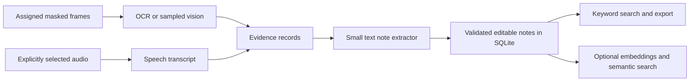

# Local AI notes and compact specialist models

Researched 2026-10-03 from official repositories, documentation and model cards. The user requested AI note-taking and very small specialized models, in the context of OpenAware. See the [research plan](../plans/note-taking-small-models.md). This is research and proposed architecture; no new model, audio recorder, persistent notes service or accelerator integration was installed or implemented.

## Recommendation for OpenAware

Use small components for separate jobs: OCR for readable screen text, a compact vision model for selected visual changes, optional speech recognition, a text model for structured notes, and a small embedding model for semantic retrieval. Start by turning existing per-agent captions into editable, timestamped notes in SQLite. Keyword search needs no additional AI model. Measure specialists against actual task accuracy and latency before choosing defaults; parameter count alone does not establish a useful monitor cadence.

OpenAware v0.4.0 currently retains bounded per-agent captions and historical summaries in session memory, and video acquisition is muted. Durable notes, audio acquisition and specialist worker roles would require separate changes. Text, OCR and embedding models cannot simply occupy a vision-agent seat that requires an image probe.

Proposed flow:

The first notes slice should save title/body, agent and source IDs/revisions, observation interval, evidence IDs/excerpts, creation time, model identity and user-edit status. Deduplicate repeated observations, retain uncertain claims as uncertain, and distinguish observations from proposed tasks or decisions. Retrieval must enforce agent/source scope before supplying context. A model-produced note grants no action authority. Persistence needs explicit retention/deletion/export controls; raw screenshots should remain optional rather than being required for every note.

## Note-taking projects and components

| Project | Verified license / execution | Fit for this app |
| --- | --- | --- |
| SQLite FTS5 | SQLite is public domain; embedded local database | First choice for saved notes, keyword/phrase search and ranked results. Paraphrase search needs another component. [FTS5](https://www.sqlite.org/fts5.html), [license](https://sqlite.org/copyright.html). |
| whisper.cpp | MIT, local CPU and supported accelerators | Transcription worker for separately selected audio. Timestamped recognized speech still needs a text summarizer; streaming/speaker features need acceptance tests. [Project](https://github.com/ggml-org/whisper.cpp), [license](https://github.com/ggml-org/whisper.cpp/blob/master/LICENSE). |
| Meetily Community | MIT community application; local transcription and selectable summary provider | Reference for audio capture, transcript review and meeting-summary UX. Cloud-provider selection changes where text goes; Community and Pro are separate offerings. [Project](https://github.com/Zackriya-Solutions/meetily), [license](https://github.com/Zackriya-Solutions/meetily/blob/main/LICENSE.md), [privacy policy](https://github.com/Zackriya-Solutions/meetily/blob/main/PRIVACY_POLICY.md). |
| OpenRecall | AGPL-3.0; local screenshot/OCR/search | Reference for screen-history retrieval and provenance, rather than a proposed copied MIT dependency. Its record schema includes time, text, embedding, app and title; retaining screenshots introduces another storage decision. [Project](https://github.com/openrecall/openrecall), [schema](https://github.com/openrecall/openrecall/blob/main/openrecall/database.py), [license](https://github.com/openrecall/openrecall/blob/main/LICENSE). |
| Mem0 OSS | Apache-2.0; configurable memory extraction/retrieval | Possible later layer. Defaults use OpenAI generation and embeddings, so both must be explicitly changed for local inference. Telemetry also needs explicit configuration; Python telemetry defaults on. Adds work beyond simple saved notes. [Defaults](https://docs.mem0.ai/open-source/overview), [local generation](https://docs.mem0.ai/components/llms/models/ollama), [local embeddings](https://docs.mem0.ai/components/embedders/models/ollama), [telemetry source](https://github.com/mem0ai/mem0/blob/main/mem0/memory/telemetry.py), [license](https://github.com/mem0ai/mem0/blob/main/LICENSE). |

Current Screenpipe main uses its Commercial License, rather than MIT; commercial integration and competing-product restrictions make it an unsuitable assumed MIT dependency for this proposal. Historical MIT commits were not audited. See its [current license](https://github.com/screenpipe/screenpipe/blob/main/LICENSE.md).

## Compact model shortlist

M means million parameters; B means billion. Checkpoint/package sizes below are published download sizes, not total process memory. Vision models may need both language weights and a vision projector; context, activations, image tokens and runtime allocations add memory. Nominal model names do not always equal total package parameter count.

| Model | Size and license | Useful role | Verified files/runtime and limits |
| --- | --- | --- | --- |
| [YOLOX-Nano](https://github.com/Megvii-BaseDetection/YOLOX) | 0.91M; Apache-2.0 project | Detect known object classes in camera frames | Official 416px detector; ONNX/OpenVINO/ncnn deployment paths. A narrow detector, not a chat model or reader of arbitrary screens. Nano support on Metis is not established by the larger YOLOX zoo entries. |
| [PP-OCRv5 mobile](https://arxiv.org/abs/2603.24373) | Published mobile system 5M; Apache-2.0 | Extract readable screen text and its location | [Recognition weights](https://huggingface.co/PaddlePaddle/PP-OCRv5_mobile_rec/tree/main) 16.5MB plus [detector](https://www.paddleocr.ai/main/en/version3.x/module_usage/text_detection.html) 4.7MB: 21.2MB combined, our sum. Needs an OCR worker; validate crops, language and small text. |
| [all-MiniLM-L6-v2](https://huggingface.co/sentence-transformers/all-MiniLM-L6-v2) | About 22.7M, calculated from official configuration; Apache-2.0 | Semantic note search, clustering and deduplication | 384-dimensional embeddings; [FP32 weights](https://huggingface.co/sentence-transformers/all-MiniLM-L6-v2/tree/main) 90.9MB or [INT8 ONNX](https://huggingface.co/sentence-transformers/all-MiniLM-L6-v2/tree/main/onnx) 23MB. Default truncation is 256 wordpieces, so chunk notes. Generates no note prose. |
| [Whisper tiny / tiny.en](https://github.com/openai/whisper) | 39M; MIT code and weights | Recognize speech for optional spoken/meeting notes | [whisper.cpp](https://github.com/ggml-org/whisper.cpp) publishes 75MiB disk and about 273MB memory; OpenAI's PyTorch path lists about 1GB VRAM. These are different runtime claims, not measurements here. Speech transcription alone does not create a meeting summary or identify speakers. |
| [SmolVLM2-256M-Video-Instruct](https://huggingface.co/HuggingFaceTB/SmolVLM2-256M-Video-Instruct) | 256M; Apache-2.0 | Small scene captions and sampled visual changes | [GGUF files](https://huggingface.co/ggml-org/SmolVLM2-256M-Video-Instruct-GGUF/tree/main): Q4 language 131MB + required Q8 vision projector 104MB = 235MB, our sum. Explicit [llama.cpp multimodal support](https://github.com/ggml-org/llama.cpp/blob/master/tools/mtmd/README.md). Exact desktop text needs testing. |
| [LFM2.5-350M](https://huggingface.co/LiquidAI/LFM2.5-350M) | 350M; custom LFM Open License v1.0 | Structured notes from OCR/captions/transcripts; text only | [Official GGUF](https://huggingface.co/LiquidAI/LFM2.5-350M-GGUF/tree/main): 219MB QAD Q4_0 or 229MB Q4_K_M; official [llama.cpp](https://docs.liquid.ai/deployment/on-device/llama-cpp) and [LM Studio](https://docs.liquid.ai/deployment/on-device/lm-studio) deployment. [Liquid's benchmark](https://www.liquid.ai/blog/lfm2-5-350m-no-size-left-behind) reports 434MB peak on Ryzen AI Max+ 395 CPU Q4 with 1K prefill + 100 generated tokens; longer contexts and this PC are untested. |
| [Qwen3.5-0.8B](https://huggingface.co/Qwen/Qwen3.5-0.8B) | Nominal 0.8B; Apache-2.0 | Compact image observer and text extraction candidate | [Ollama's tag](https://ollama.com/library/qwen3.5:0.8b) is 873M/Q8_0 with a 1.0GB download; [LM Studio](https://lmstudio.ai/unsloth/qwen3.5-0.8b) lists vision. Card warns about tiny-model thinking loops; evaluate nonthinking mode with bounded output. |
| [Qwen3-VL-2B-Instruct](https://huggingface.co/Qwen/Qwen3-VL-2B-Instruct-GGUF) | 2B; Apache-2.0 | Larger fallback for GUI/OCR-oriented observations | [Official files](https://huggingface.co/Qwen/Qwen3-VL-2B-Instruct-GGUF/tree/main): Q4 language 1.11GB + Q8 vision 445MB ≈ 1.56GB, our sum. Publisher documents llama.cpp/Ollama; [LM Studio](https://lmstudio.ai/models/qwen/qwen3-vl-2b) lists vision and a 3GB minimum-memory claim, not a local benchmark. |

Liquid's [actual license](https://huggingface.co/LiquidAI/LFM2.5-350M/blob/main/LICENSE) has a commercial-use annual-revenue threshold and redistribution notices; these weights are not MIT or Apache-2.0. Its [current model index](https://www.liquid.ai/models) marks older LFM2-350M-Extract variants deprecated. Keep model licenses separate from OpenAware's MIT code. No weights are bundled by this research.

My proposed first evaluation preset is PP-OCRv5 mobile + LFM2.5-350M for text-heavy notes, with keyword search first and MiniLM only when semantic retrieval is useful. Compare against a SmolVLM2-256M or Qwen3.5-0.8B visual observer, then the 2B fallback if important content is missed. Prefer native-resolution masked crops for OCR: a tiny model cannot recover text erased by downsampling. Camera object alerts are a separate detector task. Audio stays optional and requires its own selected input and acquisition controls.

Video-capable models consume supplied frames/clips. They do not make OpenAware's sampled image transport comprehend every intervening frame. Runtime support in a publisher guide establishes an integration route, not a successful OpenAware vision probe, working temporal prompts, sustained monitoring cadence or hardware acceleration on this computer.

## Axelera Metis

Voyager v1.8 supports compiled computer-vision pipelines and precompiled language models. Its published zoo includes Llama 3.2 1B/3B at 1024-token context with 4GB PCIe-card RAM, and larger configurations needing 16GB. These are compiled-platform requirements, not generic GGUF RAM estimates. The language-model path does not load arbitrary downloaded LLMs. [Model zoo](https://docs.axelera.ai/sdk/reference/models/model-zoo/), [LLM guide](https://docs.axelera.ai/sdk/user-guides/llm/).

The [SDK portal](https://docs.axelera.ai/sdk/) marks LLM inference experimental, so it needs its own acceptance gate.

Native Windows inference is documented through AxRuntime and precompiled SLM tooling. Custom deployment uses Linux/WSL2; WSL is optional for precompiled Windows inference, and the device is unavailable for inference inside WSL. General custom vision models need supported ONNX operators and Metis compilation. [Windows setup](https://docs.axelera.ai/sdk/user-guides/windows-setup/), [model formats](https://docs.axelera.ai/sdk/reference/pipeline/model-formats/).

My inference: Metis is worth testing for a supported camera detector or short text pipeline when that hardware is already available. It is not a drop-in substitute for OpenAware's current LM Studio/Ollama/llama.cpp endpoint, nor evidence that arbitrary compact vision models will run there. A separate adapter, model-specific compilation/support and end-to-end quality/latency tests are needed. No accelerator purchase or throughput claim follows from this research.

## Acceptance experiments before implementation defaults

Compare correctly transcribed small UI text, timestamp/order preservation, unsupported/uncertain scenes, factual note extraction and invented-task rate. Measure time to first usable result, steady-state latency, peak RAM/VRAM and queue growth with two and four assigned feeds. Test OCR-only, tiny VLM, and OCR plus text-model paths on the same synthetic clips. For audio, separately test speech/noise, timestamp drift, bounded buffers and Stop cleanup. Include malformed structured output, cancellation, reassignment and retrieval isolation. No cited project's benchmark establishes performance on this user's PC.

## Research verification

Separate read-only lanes researched note-taking projects, compact models, and Metis. An independent Senior Developer reviewed the primary-source numerical, licensing and runtime claims and returned **approved**, including the distinction between download size, working memory, vendor benchmarks and proposed integrations. Documentation links/traceability validation passes. No models or services were installed, and no new runtime feature or hardware performance was tested.
