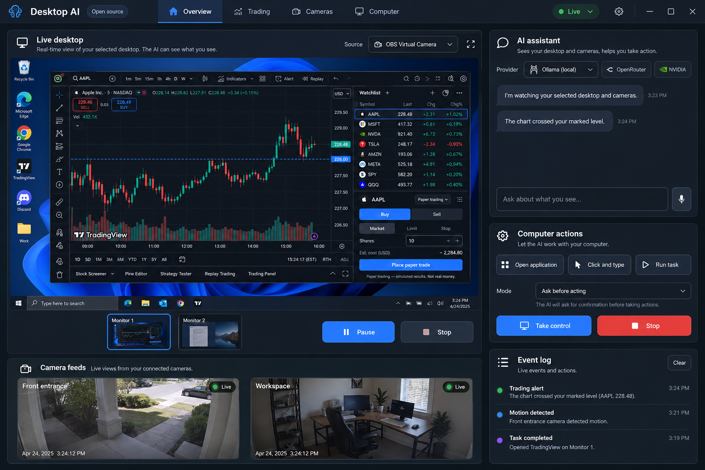
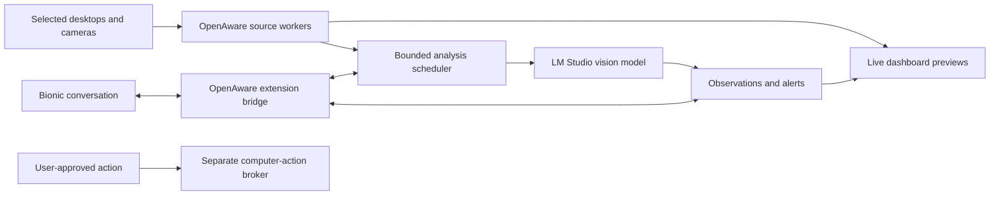

# OpenAware

An open-source AI companion for live desktop and camera awareness, designed to work with LM Studio and Bionic.

**Project status: planning foundation. There is no runnable application yet.** This repository contains the product specification, proposed architecture, integration evidence, execution slices, and release tests. A checked planning workflow does not prove live capture or inference works.

OpenAware is intended to let you watch selected monitors, virtual-camera sources, and real cameras together; ask an AI about what is visible; receive alerts; and authorize specific actions on your actual computer. Trading is one workspace, alongside camera monitoring and everyday desktop assistance.



*AI-generated interface concept, not a working product screenshot. It uses an earlier working title, Desktop AI. Market values, camera scenes, responses, and action controls are illustrative.*

## Read the plan

Start with [PLAN.md](PLAN.md). The core documents are:

| Document | What it answers |
| --- | --- |
| [Product specification](docs/product-spec.md) | User goals, features, release scope, permissions, and acceptance criteria |
| [UX specification](docs/ux-spec.md) | Onboarding, live feeds, model selection, chat, alerts, and action flows |
| [Architecture](docs/architecture.md) | Processes, adapters, scheduling, storage, and failure handling |
| [Contracts](docs/contracts.md) | Source/frame/event/model/action data and control surfaces |
| [Integration evidence](docs/integrations.md) | What vendors document versus what a prototype must verify |
| [Security and privacy](docs/security-privacy.md) | Feed boundaries, prompt injection, secrets, retention, and stop behavior |
| [Roadmap](docs/roadmap.md) | Sequenced implementation slices and release gates |
| [Testing and release](docs/testing-release.md) | Automated fixtures, Windows hardware tests, packaging, and release evidence |
| [Decision register](docs/decisions.md) | Proposed choices, unresolved questions, and decision owners |

## Intended design



The preview is continuous video. AI analysis samples eligible frames at a rate the selected model can sustain. Source identity, observation age, and degraded states must remain visible. No every-frame detection or trading-profit guarantee is part of the design.

## LM Studio and Bionic

LM Studio supplies model discovery and local vision inference. Bionic supplies its existing conversation and model-selection experience. OpenAware supplies live sources and monitoring tools. Bionic and classic LM Studio are separate applications: embedded panels, automatic picker synchronization, image delivery through a Bionic tool, and unsolicited Bionic alerts all require compatibility tests. The stand-alone dashboard is the fallback, not a hidden dependency on unsupported app internals.

Ollama, OpenRouter, OpenAI, and NVIDIA adapters are planned extensions. Cloud analysis requires an explicit destination and source consent. The OpenAI adapter would use the API; it would not sign into or impersonate a consumer ChatGPT session.

## Development now

Only the documentation validator is implemented:

```powershell
python scripts/validate_plan.py
```

See [CONTRIBUTING.md](CONTRIBUTING.md) before starting a slice. Do not treat proposed paths under `apps/` or `packages/` as existing implementations.

## License

OpenAware's original code and documentation use the [MIT license](LICENSE). Dependencies, external applications, model weights, and hosted services retain their respective licenses and terms. OpenAware is an independent community project and is not affiliated with LM Studio, OpenAI, NVIDIA, or the other referenced products.
