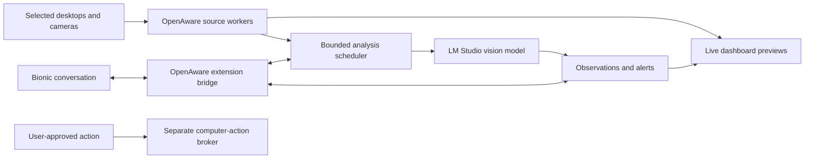

# OpenAware

An open-source AI companion for live desktop and camera awareness, designed to work with LM Studio and Bionic.

**Project status: v0.2.3 developer prototype.** Overview is one workspace with independently movable and resizable source, chat, actions, and activity panes. Two monitor panes start side by side; three or four desktop panes use two columns, with cameras below. The Electron application retains compact chat/settings controls, isolated desktop capture workers, and background monitoring with the blue tray/app icon. The original plan remains the release roadmap; personal monitor capture, real cameras/models, and native input effects still need their documented acceptance evidence. See [prototype status](docs/prototype.md) for the implementation boundary and checks.

OpenAware is intended to let you watch selected monitors, virtual-camera sources, and real cameras together; ask an AI about what is visible; receive alerts; and authorize specific actions on your actual computer. Trading is one workspace, alongside camera monitoring and everyday desktop assistance.


_Actual v0.2.3 Electron interface with synthetic demo/camera previews. This illustrates the populated layout; it does not show real camera capture or model output. A fresh launch has no selected feeds. The original [AI-generated interface concept](assets/app-concept.png) remains a planning illustration._

## Read the plan

Start with [PLAN.md](PLAN.md). The core documents are:

| Document                                         | What it answers                                                             |
| ------------------------------------------------ | --------------------------------------------------------------------------- |
| [Product specification](docs/product-spec.md)    | User goals, features, release scope, permissions, and acceptance criteria   |
| [UX specification](docs/ux-spec.md)              | Onboarding, live feeds, model selection, chat, alerts, and action flows     |
| [Architecture](docs/architecture.md)             | Processes, adapters, scheduling, storage, and failure handling              |
| [Contracts](docs/contracts.md)                   | Source/frame/event/model/action data and control surfaces                   |
| [Integration evidence](docs/integrations.md)     | What vendors document versus what a prototype must verify                   |
| [Security and privacy](docs/security-privacy.md) | Feed boundaries, prompt injection, secrets, retention, and stop behavior    |
| [Roadmap](docs/roadmap.md)                       | Sequenced implementation slices and release gates                           |
| [Testing and release](docs/testing-release.md)   | Automated fixtures, Windows hardware tests, packaging, and release evidence |
| [Decision register](docs/decisions.md)           | Proposed choices, unresolved questions, and decision owners                 |
| [Background mode](docs/background-mode.md)       | Configure a session, hide the dashboard, and use Show, Stop, or Quit        |

## Intended design



The live preview updates continuously; desktop workers deliver bounded JPEG frames at up to 15 fps, while camera previews use video. AI analysis samples eligible frames at a rate the selected model can sustain. Source identity, observation age, and degraded states must remain visible. No every-frame detection or trading-profit guarantee is part of the design.

## LM Studio and Bionic

LM Studio supplies model discovery and local vision inference. Bionic supplies its existing conversation and model-selection experience. OpenAware supplies live sources and monitoring tools. Bionic and classic LM Studio are separate applications: embedded panels, automatic picker synchronization, image delivery through a Bionic tool, and unsolicited Bionic alerts all require compatibility tests. The stand-alone dashboard is the fallback, not a hidden dependency on unsupported app internals.

The prototype also implements a local Ollama adapter. OpenRouter, OpenAI, and NVIDIA adapters remain planned extensions. Cloud analysis requires an explicit destination and source consent. The OpenAI adapter would use the API; it would not sign into or impersonate a consumer ChatGPT session.

## Windows prototype

Download the [v0.2.3 Windows x64 installer](https://github.com/johnnycoderbot-cloud/OpenAware/releases/download/v0.2.3/OpenAware.Setup.0.2.3.exe). The [developer prerelease](https://github.com/johnnycoderbot-cloud/OpenAware/releases/tag/v0.2.3) includes its SHA-256 checksum. Distribution is unsigned; packaged workflow checks and their limits are recorded in the [v0.2.3 implementation ledger](.omx/logs/implementation-v0.2.3.md). The installer itself has not been exercised. No model is bundled; real cameras/models, personal monitor and mixed-DPI capture, native input effects, and Bionic compatibility still need live acceptance tests.

## Run from source

Install Node.js 24 or later, then:

```powershell
npm ci
npm start
```

A fresh launch has no selected feeds. For live screens, click the top-bar **Add source** control, select **Monitor**, choose the screen, then click **Connect source** in the dialog. This starts the selected preview; there is no second connection step on the pane. Repeat for your second monitor. Choose **Window** instead to capture one application, or select a camera/OBS device for a camera feed. **Demo** shows generated content and does not capture your screen. The prototype supports four simultaneous sources in total.

Each source, chat, actions, and activity pane has one frame and header on the same workspace. Two monitor panes start side by side; three or four desktop panes form two-column rows, with cameras below. Drag a pane handle and drop beside, above, or below another pane; pull dividers to resize. The header's **Arrange** icon menu offers keyboard placement, and focused dividers accept arrow keys. The top-bar **Reset dashboard layout** control restores defaults. Adding or removing sources and returning to Overview also restore the default arrangement; layout changes preserve the remaining live connections. Local scrolling keeps custom wider arrangements reachable. Compact windows show panes in a single vertical order.

Each feed's settings button holds AI analysis, motion and privacy controls. In chat, **Sources** chooses which connected feeds a question uses; the message history and composer remain the main view.

Live preview needs no AI model and does not require **Start watching**. For AI monitoring, connect a running local LM Studio or Ollama server in Connections, select an image-capable model, and run the visible synthetic vision probe before clicking **Start watching**. Preview remains independent of model speed.

Observer and Operator are two cooperating roles using the explicitly selected local model. Observer describes the selected sources; Operator proposes click, typing, and keypress steps for a selected monitor. Executing a proposal uses a native review for each step, fresh target checks, and a separate Windows input worker. Stop all cancels remaining work; Ctrl+Shift+F12 is the emergency shortcut when registration succeeds. Computer effects already sent cannot be undone by Stop.

Configure your sources and monitoring, then click **Background** to hide the dashboard while the current session continues. The tray provides **Show OpenAware**, **Stop all capture and actions**, and **Quit**. Show preserves the background preference, so closing the shown window hides it again; **Window mode** clears that preference. Stop releases feeds and pending action authority while leaving the tray available. Quit stops the session and exits.

`OpenAware.exe --background` and its `--headless` alias start an idle tray session in the same interactive Windows desktop session. Sources, model binding, tokens, and history are memory only; restarting does not restore feeds automatically. Use tray Show to configure a fresh session. Background mode preserves the existing native approval requirement for every action step. See [background mode](docs/background-mode.md) for commands and lifecycle details.

Developer checks: `npm run check`, `npm test`, `npm run build`, `npm run test:desktop`, and `python scripts/validate_plan.py`. Build a Windows installer with `npm run package`; current prototypes are unsigned. See [CONTRIBUTING.md](CONTRIBUTING.md) and [prototype status](docs/prototype.md) before extending a slice.

## License

OpenAware's original code and documentation use the [MIT license](LICENSE). Dependencies, external applications, model weights, and hosted services retain their respective licenses and terms. OpenAware is an independent community project and is not affiliated with LM Studio, OpenAI, NVIDIA, or the other referenced products.
