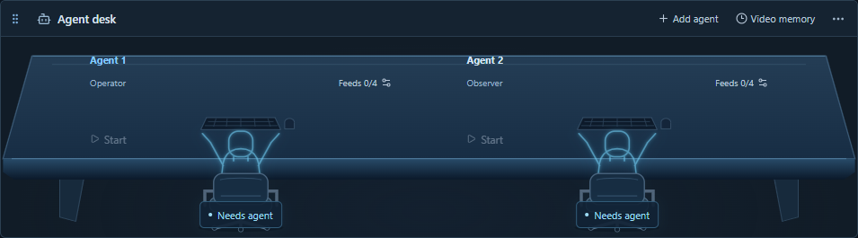
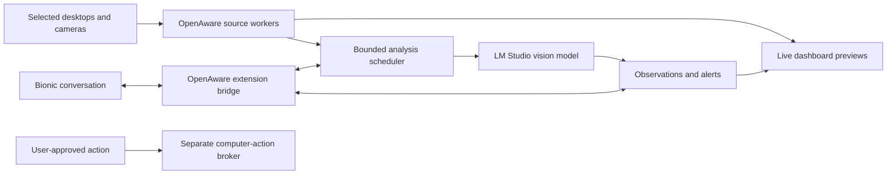

# OpenAware

An open-source AI companion for selected desktops, cameras and videos, with independently configured local AI agents.

**Project status: v0.4.0 developer prototype.** Up to four independent agents can each watch four assigned feeds from a shared library of sixteen. Each seat has its own explicit local model binding, conversation, rules, captions and work queue. Sources include monitors, windows, cameras, video files, direct video URLs and isolated web-player pages. Overview remains one flat movable/resizable workspace, with the glowing **Needs agent** desk beneath fitted feed rows. See [agents and video](docs/agents-and-video.md), [current implementation evidence](.omx/logs/independent-agents-video.md), [prototype status](docs/prototype.md) and [local video workflows](docs/local-video-workflows.md).

OpenAware is intended to let you watch selected monitors, virtual-camera sources, and real cameras together; ask an AI about what is visible; receive alerts; and authorize specific actions on your actual computer. Trading is one workspace, alongside camera monitoring and everyday desktop assistance.


_The Electron interface uses generated monitor/camera fixtures and unbound agent seats. Sources and responses are synthetic fixtures, not real model benchmarks. A fresh launch has no selected feeds. The original [AI-generated concept](assets/app-concept.png) remains a planning illustration._



## Read the plan

Start with [PLAN.md](PLAN.md). The core documents are:

| Document                                                              | What it answers                                                             |
| --------------------------------------------------------------------- | --------------------------------------------------------------------------- |
| [Product specification](docs/product-spec.md)                         | User goals, features, release scope, permissions, and acceptance criteria   |
| [UX specification](docs/ux-spec.md)                                   | Onboarding, live feeds, model selection, chat, alerts, and action flows     |
| [Architecture](docs/architecture.md)                                  | Processes, adapters, scheduling, storage, and failure handling              |
| [Contracts](docs/contracts.md)                                        | Source/frame/event/model/action data and control surfaces                   |
| [Integration evidence](docs/integrations.md)                          | What vendors document versus what a prototype must verify                   |
| [Security and privacy](docs/security-privacy.md)                      | Feed boundaries, prompt injection, secrets, retention, and stop behavior    |
| [Roadmap](docs/roadmap.md)                                            | Sequenced implementation slices and release gates                           |
| [Testing and release](docs/testing-release.md)                        | Automated fixtures, Windows hardware tests, packaging, and release evidence |
| [Decision register](docs/decisions.md)                                | Proposed choices, unresolved questions, and decision owners                 |
| [Independent agents and videos](docs/agents-and-video.md)             | Per-agent connections, assignments, PC videos and web-player links          |
| [Background mode](docs/background-mode.md)                            | Configure a session, hide the dashboard, and use Show, Stop, or Quit        |
| [Local video workflows](docs/local-video-workflows.md)                | Temporal samples, semantic alerts, caption memory, and opt-in CLI access    |
| [OpenAware workflow skill](skills/openaware-video-workflows/SKILL.md) | Commands and boundaries for agents using the local CLI                      |

## Intended design



The live preview updates continuously; desktop workers deliver bounded JPEG frames at up to 15 fps, while camera previews use video. AI analysis samples eligible frames at a rate the selected model can sustain. Temporal monitoring retains up to three masked frames per source spanning at most four seconds. Captions retain their analyzed interval, sample count and age. This samples images rather than establishing native continuous-video understanding or every-frame detection.

## LM Studio and Bionic

LM Studio supplies model discovery and local vision inference. Bionic supplies its existing conversation and model-selection experience. OpenAware supplies live sources and monitoring tools. Bionic and classic LM Studio are separate applications: embedded panels, automatic picker synchronization, image delivery through a Bionic tool, and unsolicited Bionic alerts all require compatibility tests. The stand-alone dashboard is the fallback, not a hidden dependency on unsupported app internals.

The prototype also implements local Ollama and llama.cpp adapters. Its bounded local workflows are original OpenAware code inspired by video search and summarization; they require no VSS server and contain no copied NVIDIA implementation, models or containers. OpenRouter, OpenAI, and NVIDIA provider adapters remain planned extensions. Cloud analysis requires an explicit destination and source consent. The OpenAI adapter would use the API; it would not sign into or impersonate a consumer ChatGPT session.

## Windows prototype

Version 0.4.0 verification and delivery are tracked in the [independent agents/video handoff](.omx/logs/independent-agents-video.md). The historical [v0.3.3 developer prerelease](https://github.com/johnnycoderbot-cloud/OpenAware/releases/tag/v0.3.3), [desk/header ledger](.omx/logs/workspace-agent-desk.md) and [v0.3.2 audit](.omx/logs/adversarial-audit-v0.3.2.md) preserve earlier evidence. No model is bundled. Public platform sign-in/protected playback, personal monitor/camera capture, mixed-DPI behavior, native input effects, Bionic compatibility and sustained multi-model throughput need separate live acceptance evidence.

On this computer, the tested local Ollama model recognized a synthetic single image in about 18–20 seconds; three-image temporal inference and a historical summary each reached their 60-second limits. Background captions and summaries allow 60 seconds. Chat, synthetic probes and Operator allow 20 seconds; current chat/Operator evidence must also finish within 15 seconds of capture. Delayed background captions can remain as history, but evidence older than 15 seconds cannot trigger semantic alerts. These measurements do not establish useful continuous monitoring.

## Run from source

Install Node.js 24 or later, then:

```powershell
npm ci
npm start
```

A fresh launch has one unconfigured Agent 1 and no selected feeds. Click **+ Add source** in the workspace/source header. Choose **Monitor**, **Window**, a camera/OBS device, **Video file** or **Video link**; Connect starts its preview. Video link offers a web player for YouTube, Facebook, TikTok, Instagram, X and other pages, or a direct video stream. **Open player** exposes playback controls and site sign-in. The app watches the rendered page; platform playback is not guaranteed. **Demo** is generated content. The shared library supports sixteen sources; each agent can be assigned four. [Video details](docs/agents-and-video.md).

Each source, chat, activity, and **Agent desk** view has one frame and header on the same workspace. Two monitor panes start side by side; larger desktop groups form two-column rows, with cameras below. The default feed area fits uncropped video proportions, including separate header and footer controls. Added monitor rows grow into the lower space above Agent desk. The default sidebar gives assistant 75% of its height and activity 25%. Computer actions are available on the **Operator** page in the top navigation. Drag a pane handle and drop beside, above, or below another pane; pull dividers to resize. The header's **Arrange** icon menu offers keyboard placement, and focused dividers accept arrow keys. The top-bar **Reset dashboard layout** control restores defaults. Adding or removing sources and returning to Overview also restore the default arrangement; layout changes preserve the remaining live connections. Local scrolling keeps custom wider arrangements reachable. Compact windows show panes in a single vertical order.

**Add agent** creates an independent observer or operator seat. Use its **Feeds** control to assign up to four sources, select the seat, then configure and verify its own model in Connections. New seats inherit no binding or sources. Until verified, the seat shows **Needs agent** with a cyan glowing outline. Ready/Watching/Paused reflect that agent alone. Per-seat Start/Pause preserve shared previews and other agents. **Stop all** ends every capture and invalidates every agent. The desk header’s **Memory** toggle shows the selected agent’s caption history. [Agent details](docs/agents-and-video.md).

Each feed’s settings button holds shared AI-analysis, motion and privacy controls. In chat, **Sources** selects only feeds assigned to the active agent; changing seats switches its model, conversation, rules and history while retaining capture connections.

Live preview needs no AI model and does not require **Start watching**. For AI monitoring, connect a running local LM Studio, Ollama or llama.cpp server in Connections, select an image-capable model, and run the visible synthetic vision probe before clicking **Start watching**. Preview remains independent of model speed.

Connections includes per-agent **Temporal monitoring** and up to eight semantic rules per agent with explicit source scopes. An alert requires two distinct matching observations and uses a 30-second cooldown; ambiguous, stale or malformed evidence does not alert. Alerts appear in activity and the Event log and grant no Operator authority. **Video memory** searches caption text locally by source and capture time. **Summarize history** queues a text-only summary of retained captions and displays its historical scope and completion status. No raw video recording or external NVIDIA VSS backend is added.

Observers monitor and converse. Operators also propose typed click/key steps for an assigned desktop. Only the active operator can submit its exact revisioned plan to native per-step review; selecting another agent revokes pending action authority. Video sources cannot become native input targets. Stop all cancels remaining work; Ctrl+Shift+F12 is the emergency shortcut when available. Stop cannot undo an input already sent.

Configure your sources and monitoring, then click **Background** to hide the dashboard while the current session continues. The tray provides **Show OpenAware**, **Stop all capture and actions**, and **Quit**. Show preserves the background preference, so closing the shown window hides it again; **Window mode** clears that preference. Stop releases feeds and pending action authority while leaving the tray available. Quit stops the session and exits.

`OpenAware.exe --background` and its `--headless` alias start an idle tray session in the same interactive Windows desktop session. Sources, agent bindings, tokens, media registrations, player sign-ins and history are memory only; restarting does not restore feeds automatically. Use tray Show to configure a fresh session. Background mode preserves the existing native approval requirement for every action step. See [background mode](docs/background-mode.md) for commands and lifecycle details.

CLI access is opt-in: launch a source build with `node_modules/.bin/electron.cmd . --enable-cli` after `npm run build`, then use `node dist/cli.cjs --help`. Packaged builds bundle the CLI at `resources/cli.cjs`; Node.js 24 or later is required to run it. The CLI uses a private authenticated loopback connection and cannot acquire sources or approve native input. See [local video workflows](docs/local-video-workflows.md) and the [portable workflow skill](skills/openaware-video-workflows/SKILL.md) for commands.

Developer checks: `npm run check`, `npm test`, `npm run build`, `npm run test:desktop`, and `python scripts/validate_plan.py`. Build a Windows installer with `npm run package`; current prototypes are unsigned. See [CONTRIBUTING.md](CONTRIBUTING.md) and [prototype status](docs/prototype.md) before extending a slice.

## License

OpenAware's original code and documentation use the [MIT license](LICENSE). Dependencies, external applications, model weights, and hosted services retain their respective licenses and terms. OpenAware is an independent community project and is not affiliated with LM Studio, OpenAI, NVIDIA, or the other referenced products.
