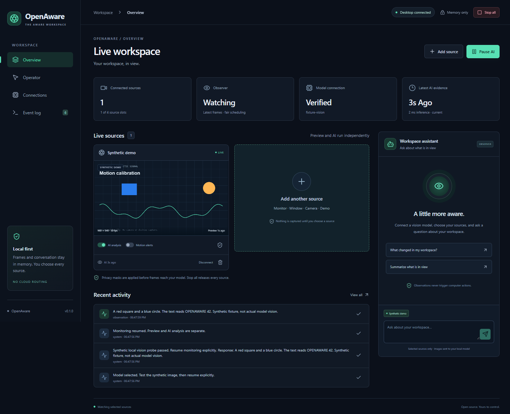
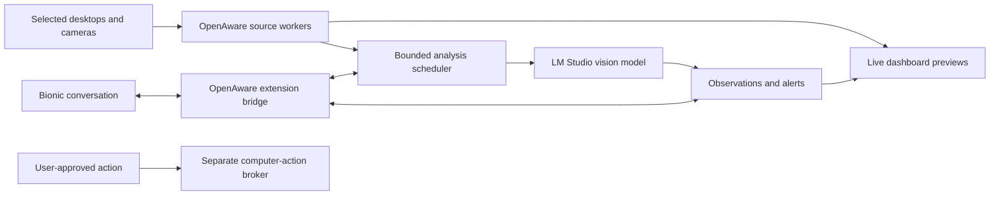

# OpenAware

An open-source AI companion for live desktop and camera awareness, designed to work with LM Studio and Bionic.

**Project status: v0.1 developer prototype.** The Electron application implements live source previews and local AI workflows. The original plan remains the release roadmap; each external integration and native action still needs its documented acceptance evidence. See [prototype status](docs/prototype.md) for the implementation boundary and measured checks.

OpenAware is intended to let you watch selected monitors, virtual-camera sources, and real cameras together; ask an AI about what is visible; receive alerts; and authorize specific actions on your actual computer. Trading is one workspace, alongside camera monitoring and everyday desktop assistance.



*Actual Electron prototype running a synthetic feed and a mock model server in the automated smoke test. This demonstrates application wiring, not real model accuracy. The original [AI-generated interface concept](assets/app-concept.png) remains a planning illustration.*

## Read the plan

Start with [PLAN.md](PLAN.md). The core documents are:

| Document | What it answers |
| --- | --- |
| [Product specification](docs/product-spec.md) | User goals, features, release scope, permissions, and acceptance criteria |
| [UX specification](docs/ux-spec.md) | Onboarding, live feeds, model selection, chat, alerts, and action flows |
| [Architecture](docs/architecture.md) | Processes, adapters, scheduling, storage, and failure handling |
| [Contracts](docs/contracts.md) | Source/frame/event/model/action data and control surfaces |
| [Integration evidence](docs/integrations.md) | What vendors document versus what a prototype must verify |
| [Security and privacy](docs/security-privacy.md) | Feed boundaries, prompt injection, secrets, retention, and stop behavior |
| [Roadmap](docs/roadmap.md) | Sequenced implementation slices and release gates |
| [Testing and release](docs/testing-release.md) | Automated fixtures, Windows hardware tests, packaging, and release evidence |
| [Decision register](docs/decisions.md) | Proposed choices, unresolved questions, and decision owners |

## Intended design



The preview is continuous video. AI analysis samples eligible frames at a rate the selected model can sustain. Source identity, observation age, and degraded states must remain visible. No every-frame detection or trading-profit guarantee is part of the design.

## LM Studio and Bionic

LM Studio supplies model discovery and local vision inference. Bionic supplies its existing conversation and model-selection experience. OpenAware supplies live sources and monitoring tools. Bionic and classic LM Studio are separate applications: embedded panels, automatic picker synchronization, image delivery through a Bionic tool, and unsolicited Bionic alerts all require compatibility tests. The stand-alone dashboard is the fallback, not a hidden dependency on unsupported app internals.

The prototype also implements a local Ollama adapter. OpenRouter, OpenAI, and NVIDIA adapters remain planned extensions. Cloud analysis requires an explicit destination and source consent. The OpenAI adapter would use the API; it would not sign into or impersonate a consumer ChatGPT session.

## Windows prototype

Download the [v0.1.0 developer prerelease](https://github.com/johnnycoderbot-cloud/OpenAware/releases/tag/v0.1.0) for Windows x64. It includes an unsigned installer and SHA-256 checksum. The packaged application passed a synthetic workflow test; the installer itself has not been exercised. No model is bundled, and real cameras, monitor capture, native input effects, and Bionic compatibility still need live acceptance tests.

## Run from source

Install Node.js 24 or later, then:

```powershell
npm ci
npm start
```

No source starts automatically. Add a synthetic demo, select a camera/OBS device, or choose a monitor/window. Connect a running local LM Studio or Ollama server in Connections, select an image-capable model, and run the visible synthetic vision probe before starting the Observer. Live preview remains independent of model speed.

Observer and Operator are two cooperating roles using the explicitly selected local model. Observer describes the selected sources; Operator proposes click, typing, and keypress steps for a selected monitor. Executing a proposal uses a native review for each step, fresh target checks, and a separate Windows input worker. Stop all cancels remaining work; Ctrl+Shift+F12 is the emergency shortcut when registration succeeds. Computer effects already sent cannot be undone by Stop.

Developer checks: `npm run check`, `npm test`, `npm run build`, `npm run test:desktop`, and `python scripts/validate_plan.py`. Build a Windows installer with `npm run package`; current prototypes are unsigned. See [CONTRIBUTING.md](CONTRIBUTING.md) and [prototype status](docs/prototype.md) before extending a slice.

## License

OpenAware's original code and documentation use the [MIT license](LICENSE). Dependencies, external applications, model weights, and hosted services retain their respective licenses and terms. OpenAware is an independent community project and is not affiliated with LM Studio, OpenAI, NVIDIA, or the other referenced products.
