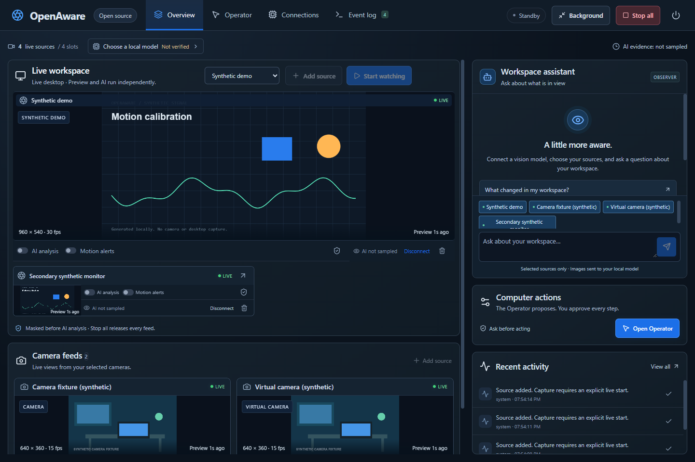
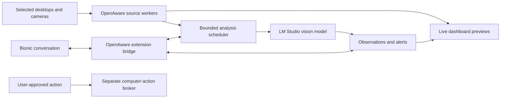

# OpenAware

An open-source AI companion for live desktop and camera awareness, designed to work with LM Studio and Bionic.

**Project status: v0.3.1 local-workflow developer prototype.** Overview is one workspace with independently movable and resizable source, chat, activity, and **Video memory** panes. Video memory searches session captions and requests asynchronous historical summaries from the selected local model. Two monitor panes start side by side; three or four desktop panes use two columns, with cameras below. Temporal monitoring and semantic alert rules can use LM Studio, Ollama or direct llama.cpp. Operator retains its separate page and action approval boundary. The unsigned Windows x64 installer is available in the [v0.3.1 developer prerelease](https://github.com/johnnycoderbot-cloud/OpenAware/releases/tag/v0.3.1), with verified uploaded checksums and Windows/Ubuntu checks for the release commit. The [llama.cpp ledger](.omx/logs/implementation-v0.3.1.md) records verification and delivery. See [prototype status](docs/prototype.md) and [local video workflows](docs/local-video-workflows.md).

OpenAware is intended to let you watch selected monitors, virtual-camera sources, and real cameras together; ask an AI about what is visible; receive alerts; and authorize specific actions on your actual computer. Trading is one workspace, alongside camera monitoring and everyday desktop assistance.



_The v0.3.1 Electron interface with synthetic demo/camera previews and Video memory. Responses belong to a mock provider fixture; the image is not a real model benchmark. A fresh launch has no selected feeds. The original [AI-generated interface concept](assets/app-concept.png) remains a planning illustration._

## Read the plan

Start with [PLAN.md](PLAN.md). The core documents are:

| Document                                                              | What it answers                                                             |
| --------------------------------------------------------------------- | --------------------------------------------------------------------------- |
| [Product specification](docs/product-spec.md)                         | User goals, features, release scope, permissions, and acceptance criteria   |
| [UX specification](docs/ux-spec.md)                                   | Onboarding, live feeds, model selection, chat, alerts, and action flows     |
| [Architecture](docs/architecture.md)                                  | Processes, adapters, scheduling, storage, and failure handling              |
| [Contracts](docs/contracts.md)                                        | Source/frame/event/model/action data and control surfaces                   |
| [Integration evidence](docs/integrations.md)                          | What vendors document versus what a prototype must verify                   |
| [Security and privacy](docs/security-privacy.md)                      | Feed boundaries, prompt injection, secrets, retention, and stop behavior    |
| [Roadmap](docs/roadmap.md)                                            | Sequenced implementation slices and release gates                           |
| [Testing and release](docs/testing-release.md)                        | Automated fixtures, Windows hardware tests, packaging, and release evidence |
| [Decision register](docs/decisions.md)                                | Proposed choices, unresolved questions, and decision owners                 |
| [Background mode](docs/background-mode.md)                            | Configure a session, hide the dashboard, and use Show, Stop, or Quit        |
| [Local video workflows](docs/local-video-workflows.md)                | Temporal samples, semantic alerts, caption memory, and opt-in CLI access    |
| [OpenAware workflow skill](skills/openaware-video-workflows/SKILL.md) | Commands and boundaries for agents using the local CLI                      |

## Intended design



The live preview updates continuously; desktop workers deliver bounded JPEG frames at up to 15 fps, while camera previews use video. AI analysis samples eligible frames at a rate the selected model can sustain. Temporal monitoring retains up to three masked frames per source spanning at most four seconds. Captions retain their analyzed interval, sample count and age. This samples images rather than establishing native continuous-video understanding or every-frame detection.

## LM Studio and Bionic

LM Studio supplies model discovery and local vision inference. Bionic supplies its existing conversation and model-selection experience. OpenAware supplies live sources and monitoring tools. Bionic and classic LM Studio are separate applications: embedded panels, automatic picker synchronization, image delivery through a Bionic tool, and unsolicited Bionic alerts all require compatibility tests. The stand-alone dashboard is the fallback, not a hidden dependency on unsupported app internals.

The prototype also implements local Ollama and llama.cpp adapters. Its bounded local workflows are original OpenAware code inspired by video search and summarization; they require no VSS server and contain no copied NVIDIA implementation, models or containers. OpenRouter, OpenAI, and NVIDIA provider adapters remain planned extensions. Cloud analysis requires an explicit destination and source consent. The OpenAI adapter would use the API; it would not sign into or impersonate a consumer ChatGPT session.

## Windows prototype

The v0.3.1 implementation passes strict TypeScript, 152 unit/integration tests and 11 packaged desktop workflows. The [v0.3.1 developer prerelease](https://github.com/johnnycoderbot-cloud/OpenAware/releases/tag/v0.3.1) contains the unsigned installer and checksum; its exact source commit passed Windows/Ubuntu application and planning checks. The [llama.cpp ledger](.omx/logs/implementation-v0.3.1.md) records delivery; the [v0.3 ledger](.omx/logs/implementation-v0.3.md) preserves the prior release evidence. No model is bundled. Personal monitor/camera capture, mixed-DPI behavior, native input effects, Bionic compatibility and sustained model throughput still need acceptance evidence.

On this computer, the tested local Ollama model recognized a synthetic single image in about 18–20 seconds; three-image temporal inference and a historical summary each reached their 60-second limits. Background captions and summaries allow 60 seconds. Chat, synthetic probes and Operator allow 20 seconds; current chat/Operator evidence must also finish within 15 seconds of capture. Delayed background captions can remain as history, but evidence older than 15 seconds cannot trigger semantic alerts. These measurements do not establish useful continuous monitoring.

## Run from source

Install Node.js 24 or later, then:

```powershell
npm ci
npm start
```

A fresh launch has no selected feeds. For live screens, click the top-bar **Add source** control, select **Monitor**, choose the screen, then click **Connect source** in the dialog. This starts the selected preview; there is no second connection step on the pane. Repeat for your second monitor. Choose **Window** instead to capture one application, or select a camera/OBS device for a camera feed. **Demo** shows generated content and does not capture your screen. The prototype supports four simultaneous sources in total.

Each source, chat, activity, and **Video memory** view has one frame and header on the same workspace. Two monitor panes start side by side; three or four desktop panes form two-column rows, with cameras below. The default feed area fits uncropped video proportions, including separate header and footer controls. Added monitor rows grow into the lower space above Video memory. The default sidebar gives assistant 75% of its height and activity 25%. Computer actions are available on the **Operator** page in the top navigation. Drag a pane handle and drop beside, above, or below another pane; pull dividers to resize. The header's **Arrange** icon menu offers keyboard placement, and focused dividers accept arrow keys. The top-bar **Reset dashboard layout** control restores defaults. Adding or removing sources and returning to Overview also restore the default arrangement; layout changes preserve the remaining live connections. Local scrolling keeps custom wider arrangements reachable. Compact windows show panes in a single vertical order.

Each feed's settings button holds AI analysis, motion and privacy controls. In chat, **Sources** chooses which connected feeds a question uses; the message history and composer remain the main view.

Live preview needs no AI model and does not require **Start watching**. For AI monitoring, connect a running local LM Studio, Ollama or llama.cpp server in Connections, select an image-capable model, and run the visible synthetic vision probe before clicking **Start watching**. Preview remains independent of model speed.

Connections includes **Temporal monitoring** and up to eight semantic rules with explicit source scopes. An alert requires two distinct matching observations and uses a 30-second cooldown; ambiguous, stale or malformed evidence does not alert. Alerts appear in activity and the Event log and grant no Operator authority. **Video memory** searches caption text locally by source and capture time. **Summarize history** queues a text-only summary of retained captions and displays its historical scope and completion status. No raw video recording or external NVIDIA VSS backend is added.

Observer and Operator are two cooperating roles using the explicitly selected local model. Observer describes the selected sources; Operator proposes click, typing, and keypress steps for a selected monitor. Executing a proposal uses a native review for each step, fresh target checks, and a separate Windows input worker. Stop all cancels remaining work; Ctrl+Shift+F12 is the emergency shortcut when registration succeeds. Computer effects already sent cannot be undone by Stop.

Configure your sources and monitoring, then click **Background** to hide the dashboard while the current session continues. The tray provides **Show OpenAware**, **Stop all capture and actions**, and **Quit**. Show preserves the background preference, so closing the shown window hides it again; **Window mode** clears that preference. Stop releases feeds and pending action authority while leaving the tray available. Quit stops the session and exits.

`OpenAware.exe --background` and its `--headless` alias start an idle tray session in the same interactive Windows desktop session. Sources, model binding, tokens, and history are memory only; restarting does not restore feeds automatically. Use tray Show to configure a fresh session. Background mode preserves the existing native approval requirement for every action step. See [background mode](docs/background-mode.md) for commands and lifecycle details.

CLI access is opt-in: launch a source build with `node_modules/.bin/electron.cmd . --enable-cli` after `npm run build`, then use `node dist/cli.cjs --help`. The v0.3.1 package bundles the CLI at `resources/cli.cjs`; Node.js 24 or later is required to run it. The CLI uses a private authenticated loopback connection and cannot acquire sources or approve native input. See [local video workflows](docs/local-video-workflows.md) and the [portable workflow skill](skills/openaware-video-workflows/SKILL.md) for commands.

Developer checks: `npm run check`, `npm test`, `npm run build`, `npm run test:desktop`, and `python scripts/validate_plan.py`. Build a Windows installer with `npm run package`; current prototypes are unsigned. See [CONTRIBUTING.md](CONTRIBUTING.md) and [prototype status](docs/prototype.md) before extending a slice.

## License

OpenAware's original code and documentation use the [MIT license](LICENSE). Dependencies, external applications, model weights, and hosted services retain their respective licenses and terms. OpenAware is an independent community project and is not affiliated with LM Studio, OpenAI, NVIDIA, or the other referenced products.
