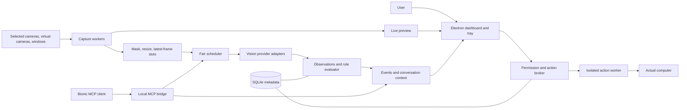

# OpenAware architecture

Status: target architecture for the full roadmap. The [v0.1 prototype](prototype.md) implements a subset; native effects and sustained performance remain unverified. Baseline: Windows first, public repository, MIT project code. Related: [product](product-spec.md), [contracts](contracts.md), [privacy and security](security-privacy.md), [integration evidence](integrations.md), [roadmap](roadmap.md).

## System responsibility

OpenAware observes selected desktops and cameras, combines timestamped observations, converses about them, and proposes separately authorized computer actions. Live video delivery and model reasoning are different pipelines. A smooth preview never means the model interpreted every frame. Trading begins with observation, structured alerts, and paper proposals; broker execution requires a later adapter and release gate.

The first release should work independently of Bionic. Bionic supplies a conversational client through a tested MCP/skill bridge; OpenAware owns capture, scheduling, rules, event history, and permissions. Bionic's conversation model and OpenAware's background analysis model are explicit bindings. Selecting one in Bionic does not silently change the other.

MCP image or summary delivery is an export to another application. OpenAware cannot control a host's later provider routing or history. Pairing therefore requires a separate image/summary-export grant describing that boundary. Strict local-only sources deny export to a host whose route cannot be verified; the host's model picker alone is not an enforceable OpenAware policy.

## Architecture choice

| Option | Benefits | Costs and failure boundary | Decision |
|---|---|---|---|
| Browser dashboard with a capture tab | Small distribution; quick camera prototype | Tab lifecycle and device permissions complicate persistent capture; actual computer actions need a separate host | Suitable capture spike, not release baseline |
| Electron dashboard and a local modular service | One install, tray controls, isolated adapters, provider-independent contracts | Electron distribution size, patch maintenance, child-process supervision, native-helper packaging | Recommended |
| Separate network services | Independent scaling and remote deployments | Authentication, deployment, distributed transactions, and privacy surface exceed the first release's needs | Revisit for explicitly requested remote fleets |

This is a modular application with a few isolation processes, not a microservice deployment. Domain policies use plain TypeScript and validated data. Provider SDKs, Electron, capture APIs, persistence, and action APIs stay in adapters. Rules and permissions justify domain modeling; device enumeration and settings remain simple application services.

## Process and module boundaries

| Boundary | Proposed location | Owns | Cannot own |
|---|---|---|---|
| Electron main supervisor | `apps/desktop/src/main` | Window/tray lifecycle, install secrets, narrow IPC, worker supervision, native approval UI | Vision-derived decisions or provider credentials in renderer |
| Sandboxed React renderer | `apps/desktop/src/renderer` | Feed grid, source selection, freshness, conversation, alert and approval presentation | Filesystem, arbitrary HTTP destinations, shell access, approval token creation |
| Node local service | `apps/service` | Source registry, scheduler, model binding, watches, event bus, retention, cancellation | Undocumented Bionic internals or direct mouse/keyboard calls |
| Pure domain modules | `packages/core` | Permission evaluation, revisions, budgets, rule transitions, proposal state | Imports from Electron, SQLite, HTTP, provider SDKs |
| Capture adapters/workers | `packages/capture` | Enumerate allowed devices, acquire pixels, preview transport, frame timestamps | Decide to send to cloud or interpret a screen as an instruction |
| Inference adapters | `packages/providers` | Capability probes, vendor requests, token/cost accounting, result normalization | Automatic provider fallback or unrestricted tool execution |
| Persistence adapter | `packages/storage` | Schema migrations, transactions, encryption of sensitive fields, pruning | Raw-frame archive by default |
| MCP bridge | `packages/mcp` | Scoped tool contracts and client sessions | Grant capture/action/cloud consent or assume unsolicited client notifications work |
| Action worker | `packages/actions` | Execute an approved typed operation; report effects and unknown outcomes | Accept a free-form model script or retry uncertain side effects |

The supervisor launches a private service child and isolated capture/action workers. Internal communication uses authenticated local IPC with schema validation and per-message limits. Source failure does not terminate unrelated feeds. Camera and OBS capture technology is selected through a Windows spike; persistent monitoring must be verified with the dashboard minimized before release. Direct monitor/window capture investigates Windows Graphics Capture behind the same port, respecting supported selection and protected-content behavior. [Microsoft capture documentation](https://learn.microsoft.com/en-us/windows/apps/develop/media-authoring-processing/screen-capture)

Preview permission authorizes selected app sources, subject to operating-system permission and device availability. It is not an operating-system permission bypass. Privileged workers must be separately restricted and supervised; a separate process alone is not a security sandbox. The renderer uses context isolation, disabled Node integration, sandboxing, restricted navigation, a local content policy, and sender-checked IPC. [Electron security guidance](https://www.electronjs.org/docs/latest/tutorial/security)

## Two pipelines

1. A capture worker emits source-native video to a preview transport and emits bounded, timestamped analysis candidates. The preview must continue during a slow model call. Avoid base64 copies of every preview frame over JSON IPC; compare GPU/shared-buffer and compressed-stream approaches in the capture spike.
2. A frame pipeline applies source-specific masks and regions of interest, resizes, calculates change metrics, and places the newest candidate in that source's slot. No model receives an unmasked original through a second route.
3. The scheduler validates consent, source revision, session epoch, freshness, budget, and model capabilities at dispatch. It pins only the in-flight frame and dispatches through the selected provider adapter.
4. Parsed observations retain source and frame lineage. Rules produce state transitions and deduplicated events. The conversation receives a bounded summary and fresh evidence on demand.

An OBS composition is one physical source. Separate monitor reasoning requires explicit regions of interest with parent-frame lineage, or separate native monitor adapters. Regions are not independent cameras and inherit the parent's capture/route permissions. Show crop labels, geometry revision, and parent identity; changing the OBS layout invalidates previous crops until the user confirms the layout.

## Proposed baseline configuration

These defaults and performance targets are planning hypotheses. They must be measured on named hardware with a named model and source set; they are not release promises.

| Setting | Proposed default or target | Behavior when exceeded |
|---|---|---|
| Selected physical sources | 4; optional derived ROIs bounded to 16 logical sources/session total | Explicit enablement and benchmark needed above 4 physical; never silently exclude a feed |
| Preview | 1280 x 720 maximum, 15 fps/source target | Reduce preview quality/cadence with visible reason; maintain original geometry metadata |
| Decoded worker frame | <=36 MiB per buffer, bounded format/stride/dimensions; negotiate 720p cameras first | Downscale in a validated native path or reject before CPU allocation; measure ultrawide/4K support separately |
| Analysis eligibility | Once per 2 s/source | Eligibility only; actual dispatch adapts to measured throughput |
| Analysis image | 1024 px longest edge, JPEG quality 75, 1 MiB compressed cap | Tile/crop on explicit request or reduce size; report unreadable text rather than invent it |
| Local inference | 1 request in flight | Queue by latest source slot; expose the model contention caused by Bionic or other clients |
| Optional cloud inference | 1 in flight/provider, 2 total | Enabled per route after cloud opt-in; use the same budgets and freshness checks |
| Pending frame queue | 1 newest candidate per logical source; at most 4 pinned in-flight frame references globally plus previews | Replace older pending frame; admission reserves pins, so a 4-frame question occupies all pins |
| Dispatch maximum age | 5 s | Discard and reacquire; no stale dispatch disguised as live |
| Accepted observation age | 15 s at completion | Later response stored as stale metadata, excluded from live rule evaluation |
| Provider timeout | 20 s; action inspection separately 5 s | Cancel locally and enter degraded state; provider cancellation is best effort |
| Frame allocation | 256 MiB total controlled capture/analysis buffers | Release superseded buffers and lower quality; display unavailable rather than exceed bound |
| Live content history | Memory only, 1000 events or 16 MiB/session | Prune oldest content; display history gaps; structural settings persist separately |
| Optional saved history | Off; when enabled, 7 days or 100 MiB, whichever comes first | Encrypt and prune saved summaries; raw frames remain unrecorded |
| Health target | Frame freshness/error indicators visible within 1 s of detection | Track as UI update latency, not model understanding latency |
| Emergency stop target | Block new dispatch/actions immediately; acknowledgement/no new acquisition within 1 s; device/resource teardown within 2 s | Supervisor terminates nonresponsive worker; report remote requests that may still finish |

Preview memory, decode queues, in-flight originals, resized frames, provider serialization, and IPC copies all count toward buffer accounting. The model's VRAM/RAM and another application's buffers do not; display their separately measured usage when available. Do not equate compressed-byte caps with decoded-memory caps. Apply decoded dimension limits before allocating untrusted camera frames.

With four continuously changing sources eligible every two seconds, the requested aggregate analysis rate is two requests/second. A single local model averaging five seconds/request supplies roughly 0.2 requests/second before overhead. The scheduler must slow per-source cadence and show the observed analysis interval; these figures illustrate capacity arithmetic, not a benchmark.

## Scheduling, fairness, and change detection

Maintain one replaceable latest-frame slot for every eligible source. When a new candidate arrives, release the old pending candidate: drop oldest. Never replace an in-flight reference. When memory cannot admit a new frame after releasing superseded data, drop the incoming candidate, increment an overload counter, and keep the last preview visibly marked with its age. Historical analysis is a later, separate replay mode.

Use weighted deficit round robin for dispatch: critical watched source weight 3, ordinary active watch 2, ambient enabled source 1. Default sources all have weight 1. Each dispatch consumes one credit regardless of scene size; providers can add measured cost weights later. A source receives at most one dispatch per pass while another source is eligible. Noisy changes do not accumulate extra credits or generate an unbounded priority queue.

Interactive questions may take the next available slot, bounded to one consecutive interactive dispatch when background work is waiting. A user-selected urgent watch does not preempt an already running request. Track each source's waiting time; force the oldest eligible source after a full fairness round. Under insufficient throughput, enlarge the reported analysis interval instead of promising a maximum starvation time that capacity cannot support.

Change detection uses low-resolution pixel metrics as an admission hint, not an assurance of semantic equivalence. Every enabled watched source receives a periodic heartbeat eligibility attempt at least every 10 s even when change detection is quiet. Adaptive cadence may raise that interval under sustained contention, displayed per feed. Fast transitions can be missed between eligible frames. Structured price/volume rules use a separate licensed market-data adapter when available; screenshots are not a price tick feed.

Deterministic motion/change rules consume sanitized capture metrics independently of model inference, so a slow model cannot stop basic motion evaluation. Proposed spike defaults: downsample to 160 x 90 luminance at 5 Hz, mark pixels changed at absolute difference >=15/255, trigger if >=10% change for two samples, reset below 5% for two samples, cooldown 30 s. These parameters are tunable hypotheses, not validated motion accuracy. Missing samples, invalid masks, device failure, or reconnect make the deterministic rule unknown; do not infer an empty scene from missing evidence.

## Model binding and handover

Discover models from the explicitly selected endpoint; do not auto-download, auto-load, or unload a model another app may use. Select by stable provider/model identifier plus a capability profile, not a display name. Vision input is required for observations; image limits, tool support, context budget, storage behavior, streaming, and actual loaded state must be checked separately. Unknown capabilities remain unknown until a synthetic, nonprivate probe verifies them.

A user-requested model change immediately pauses dispatch, cancels old work, and invalidates its generation while previews continue. Selection follows `requested -> probing -> ready -> activating -> active`, or `failed`. Preserve the previous binding only as rollback configuration while probing; it does not continue analysis. A successful handover increments `bindingRevision` and requires explicit Resume before dispatch. A failed probe leaves the previous selection available but monitoring paused until the user resumes it. Release in-flight references on acknowledgement or bounded timeout. If loading the replacement would require unloading the current model or exceed hardware capacity, obtain a native user choice before that operation; never silently evict Bionic's model.

LM Studio is the reference adapter. Its native chat requests must explicitly set `store:false`; server history, caches, logs, and model runtime copies are external retention boundaries requiring separate configuration and verification. Other adapters must publish a retention-status field. Local frame memory-only mode means OpenAware does not record raw feeds; it cannot establish that a provider keeps no data. See [integration evidence](integrations.md).

Cloud routing is a source-specific grant intersected with provider, endpoint, purpose, and active watch. Masking occurs first. No automatic local-to-cloud fallback is allowed. Cloud budget starts at zero until the user sets a per-session request or spend limit; missing provider price/usage information requires a request-count cap and clearly labels monetary estimates unknown. Errors, slow local inference, or a nonvision local model never create consent.

## Persistence, recovery, and observability

SQLite holds versioned source/rule configuration, consent revisions, model bindings, and minimal content-free action/idempotency audit records. Conversation, observations, and events remain memory-only by default; optional saved summary history requires a separate grant. One service owns writes. Transactions cover consent mutation and cancellation epoch changes; action-token consumption and action start are atomic. Persist descriptive sensitive configuration and opted-in history as encrypted blobs; structural fields remain plaintext with restrictive filesystem permissions. Raw video and image payloads stay in memory unless an independently authorized recording feature is introduced.

On restart, sources are discovered but capture, cloud routes, active watches, and actions remain stopped until the user resumes the session. Replay metadata does not restart actions. Process crashes, sleep, device reconnect, and geometry changes increment relevant epochs/revisions so old work cannot reattach to a new feed. Reconnect uses capped backoff (1, 2, 4, 8, then 30 s), visibly reports unavailable sources, and never chooses another camera by index.

Record per-source preview fps, frame age, dispatch wait, analysis latency, observed interval, dropped frames by reason, stale/revision-rejected responses, watch health, and buffer use. Record provider timeouts, capability failures, request counts, model contention, and price availability. Correlation IDs join source/frame/request/event/action traces without embedding pixels, prompts, OCR, keys, or raw camera URLs in logs. Distinguish `observing`, `preview only`, `analysis delayed`, `stale`, `permission denied`, `device lost`, and `stopped` in the UI.

## Prototype gates and evolution

- Capture gate: OBS and ordinary cameras preview concurrently; minimized-window and stop tests; investigate native monitor/window capture before promising all Windows surfaces.
- Bionic gate: test selected-version MCP configuration, image content, tool schema handling, cancellation, and polling/notification behavior. Keep a standalone dashboard and polling event tool regardless of unsupported features.
- Provider gate: synthetic capability probes, storage configuration, image payload compatibility, concurrency, timeout, and model handover. A successful plain text request is not a vision pass.
- Action gate: typed operations, native approval, revision/freshness checks, atomic single-use authorization, and unknown-outcome tests before enabled actions ship.
- Performance gate: publish a repeatable benchmark matrix rather than claiming universal source counts or model rates.

Extract workers or services only when measurements or deployment needs justify them. Preserve source/frame/event contracts when adding microphone/voice, IP camera adapters, recording, remote clients, market data, or a broker adapter. Each addition extends capability and retention grants instead of inheriting permission from a previous integration.
