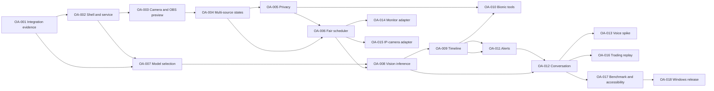

# OpenAware delivery roadmap

Status: full target roadmap, baseline 2026-10-02. The repository now includes a [working developer prototype](prototype.md). Application construction and public MIT delivery were subsequently authorized; real integrations and production release gates still require their own acceptance evidence.

## Scope and estimates

OpenAware is a live AI companion for selected actual desktops and cameras. The independent Windows dashboard supports observation, source-aware conversation, alerts, trading discussion, and a later separately authorized computer-action capability. LM Studio is the reference local model host. Bionic is the preferred agent/conversation companion after its bridge is tested; the dashboard remains useful without it.

The proposed build uses Electron, React, TypeScript, a Node service, and SQLite. [Product behavior](product-spec.md), [user journeys](ux-spec.md), [architecture](architecture.md), [contracts](contracts.md), [integration evidence](integrations.md), [privacy](security-privacy.md), and [decisions](decisions.md) govern implementation.

A reference scenario starts with four selected sources, 720p target previews, per-source analysis eligibility every 2 seconds, one local inference in flight, and one newest pending frame per source. These are proposed test/configuration defaults. Actual camera negotiation, preview frame rate, model response delay, and achieved frame age must be measured. Four-source eligibility does not promise four fresh analyses every 2 seconds.

The backlog contains **26 stable slices**: OA-001 to OA-018 describe the initial implementation path, and OA-019 to OA-026 are separately gated later adapters/actions/broker work. Initial slices group named 30-60 minute developer work units. Their aggregate **68-136 hours is only a first implementation-pass work-unit budget, not a validated alpha completion estimate**. It assumes an experienced developer, prepared environment, and reusable fixtures. Code review, rework, media/voice/hardware uncertainty, integration waits, security validation, packaging/signing, and unsupported vendor behavior are additional and can dominate elapsed effort. No calendar commitment is made. Later slice effort is TBD until its capability/authorization spike defines a bounded implementation.

A contributor claims one bounded work unit at a time and submits acceptance evidence. A spike may finish by documenting a defer decision and supported fallback; that outcome does not imply a runnable feature shipped.

## Release phases and exit criteria

| Phase | Purpose | Exit criteria |
| --- | --- | --- |
| P0 — evidence | Verify local vision and Bionic boundaries | G0 has versioned synthetic evidence for LM Studio discovery/vision, Bionic discovery/image output, explicit picker-sync/embedding/push-alert outcomes, and standalone fallbacks. |
| P1 — selected live sources | Shell, preview, source lifecycle | G1 proves consented OBS/ordinary camera previews, four-source synthetic operation, independent states, global stop, and authenticated local lifecycle. No analysis starts merely from preview. |
| P2 — bounded local awareness | Privacy, fair scheduling, explicit model identity, analysis | G2 proves masks before all egress, policy revocation, bounded queues, fair scheduling, honest freshness, mock failure handling, and opt-in local LM Studio inference. |
| P3 — useful assistant | Timeline, Bionic tools, alerts, grounded conversation | G3 proves retention, read-only MCP tools if validated or an explicit bridge defer outcome, source-attributed answers, stale/unknown suppression, debounced local alerts, and standalone behavior when Bionic is unavailable. |
| P4 — validated extensions | Voice, monitor/IP adapters, structured trading | Each G4 extension has separate evidence and may be deferred. Numeric trading conditions use structured data; paper proposals have no live order route. An unsupported extension cannot block truthful release of P1-P3. |
| P5 — Windows alpha | Benchmark, accessibility, packaging, release hygiene | G5 proves reference-host measurements, stop/resource and core accessibility checks, clean installation, notices/SBOM, checksum/provenance, and a truthful shipped/deferred feature matrix. A signed artifact is required before advertising signed or verified publisher status. |

The later backlog has no initial alpha deadline: OA-019..022 add optional providers, OA-023..024 add explicitly granted computer actions, OA-025 adds broker sandbox order state, and OA-026 is a separately authorized live-order design/implementation gate. These capabilities never become authorized simply by finishing an alpha.

P4 work can proceed independently after its dependencies and hardware/provider choice are satisfied. P5 depends on the initial camera/OBS plus LM Studio standalone foundation; Bionic may be explicitly deferred; monitor, IP-camera, voice, and trading extensions are included only when their own gate passes. Any extension deferred from release must be absent or visibly unavailable in the user interface.

## Dependency map

The machine-readable [slice manifest](../.omx/plans/implementation-slices.json) is authoritative for complete dependencies. The diagram shows the main path and independent extensions.

## Execution slices

Issue IDs are stable. Target paths describe the full roadmap; [prototype status](prototype.md) identifies the currently implemented subset. Runnable service code belongs in `apps/service`; shared logic belongs under the architecture's `packages/core`, `capture`, `providers`, `storage`, `mcp`, `actions`, and `contracts` modules.

Each slice ends with a reviewable handoff: changed files, requirement IDs, acceptance results, commands/manual steps, redacted evidence, unresolved limitations, and a gate decision (pass, defer, or changes required). Later integrations wait for their explicit gate; the [prototype ledgers](../.omx/logs/execution-ledger.md) record subsequent application authorization and evidence. OA-010 is optional for standalone alpha: alerts, chat, release, and the future action grant broker do not depend on Bionic.

| ID | Slice | Phase | Dependencies | Effort assumption |
| --- | --- | --- | --- | --- |
| OA-001 | [Verify LM Studio and Bionic integration boundaries](#oa-001) | P0 | None | 4-8 first-pass units |
| OA-002 | [Create desktop shell and authenticated local service lifecycle](#oa-002) | P1 | OA-001 | 4-8 first-pass units |
| OA-003 | [Add one camera or OBS virtual-camera live preview](#oa-003) | P1 | OA-002 | 4-8 first-pass units |
| OA-004 | [Coordinate simultaneous source states and global stop](#oa-004) | P1 | OA-003 | 4-8 first-pass units |
| OA-005 | [Enforce masks, provider consent, and retention policy before export](#oa-005) | P2 | OA-004 | 4-8 first-pass units |
| OA-006 | [Implement bounded fair scheduling and freshness accounting](#oa-006) | P2 | OA-004, OA-005 | 4-8 first-pass units |
| OA-007 | [Use LM Studio model discovery and explicit selection](#oa-007) | P2 | OA-001, OA-002 | 3-6 first-pass units |
| OA-008 | [Analyze one bounded frame through LM Studio](#oa-008) | P2 | OA-006, OA-007 | 4-8 first-pass units |
| OA-009 | [Store metadata events and a bounded local timeline](#oa-009) | P3 | OA-008 | 3-6 first-pass units |
| OA-010 | [Expose read-only observation tools to Bionic](#oa-010) | P3 | OA-001, OA-005, OA-009 | 4-8 first-pass units |
| OA-011 | [Add watch rules, debounced local alerts, and event acknowledgement](#oa-011) | P3 | OA-009 | 4-8 first-pass units |
| OA-012 | [Add a grounded conversation panel](#oa-012) | P3 | OA-008, OA-009, OA-011 | 3-6 first-pass units |
| OA-013 | [Spike voice input/output without weakening stop controls](#oa-013) | P4 | OA-012 | 3-6 first-pass units |
| OA-014 | [Validate and add a direct-monitor capture adapter](#oa-014) | P4 | OA-004, OA-005, OA-006 | 4-8 first-pass units |
| OA-015 | [Validate and add an IP-camera stream adapter](#oa-015) | P4 | OA-004, OA-005, OA-006 | 4-8 first-pass units |
| OA-016 | [Add structured market conditions and paper-only trade proposals](#oa-016) | P4 | OA-009, OA-011, OA-012 | 4-8 first-pass units |
| OA-017 | [Measure four-source behavior and close accessibility gaps](#oa-017) | P5 | OA-011, OA-012 | 4-8 first-pass units |
| OA-018 | [Package and release an auditable Windows alpha](#oa-018) | P5 | OA-005, OA-009, OA-011, OA-012, OA-017 | 4-8 first-pass units |
| OA-019 | [Add a verified Ollama vision adapter](#oa-019) | later | OA-005, OA-006, OA-008 | TBD after gate; excluded |
| OA-020 | [Add a consented OpenRouter vision adapter](#oa-020) | later | OA-005, OA-006, OA-008 | TBD after gate; excluded |
| OA-021 | [Add an OpenAI image-vision adapter](#oa-021) | later | OA-005, OA-006, OA-008 | TBD after gate; excluded |
| OA-022 | [Add one evidenced NVIDIA model deployment adapter](#oa-022) | later | OA-005, OA-006, OA-008 | TBD after gate; excluded |
| OA-023 | [Build a scoped action proposal and grant broker](#oa-023) | later | OA-005, OA-012, OA-017 | TBD after gate; excluded |
| OA-024 | [Execute one granted Windows action against a disposable app](#oa-024) | later | OA-023, OA-014 | TBD after gate; excluded |
| OA-025 | [Model a broker sandbox and paper-order lifecycle](#oa-025) | later | OA-016, OA-023 | TBD after gate; excluded |
| OA-026 | [Design and separately gate live-order authorization and reconciliation](#oa-026) | later | OA-025, OA-023, OA-018 | TBD after gate; excluded |

### OA-001

**Verify LM Studio and Bionic integration boundaries** — P0; dependencies: none.

**Requirement IDs:** `OA-AI-003`, `OA-MOD-003`.

**Deliverable:** Verify LM Studio and Bionic integration boundaries. **Effort assumption:** 4-8 first-pass work-unit hours; NOT an alpha completion estimate; assumption: 8 bounded 30-60 minute work units, prepared environment and fixtures; integration waits/rework excluded.

**Target files**

- `tools/spikes/lm-studio.ts`
- `tools/spikes/bionic-mcp.ts`
- `docs/integrations.md`
- `docs/decisions.md`

**Acceptance**

- Record tested application/API versions, platform, hardware class, and model identifier without secrets.
- Demonstrate vision request success or a reproducible failure against LM Studio; record capability metadata separately from tested inference.
- Test Bionic MCP tool discovery and image-content delivery; record unsupported image handling and a text-observation fallback.
- Treat selected-model synchronization, an embedded dashboard, and unsolicited Bionic alerts as separate unresolved capabilities until demonstrated.

**Verification**

- Opt-in local spike with a synthetic labeled image and no personal feeds.
- Capture redacted request/response schemas, selected-model observations, and a pass/fail matrix.
- Verify the standalone fallback is documented for each unsupported Bionic feature.

**Bounded work units** — initial units assume 30-60 minutes; later units are discovery/planning/review only until the gate defines implementation. Split any unit that does not fit.

1. Create synthetic image and version recorder.
2. Probe model discovery schema.
3. Probe vision inference with a test image.
4. Launch minimal stdio MCP fixture.
5. Verify Bionic discovery and image output.
6. Inspect selected-model exposure.
7. Inspect embedding and notification support.
8. Write evidence and fallback decisions.

**Exit gate:** G0: LM Studio reference evidence accepted; Bionic outcomes pass or explicitly defer with standalone/manual-binding/local-alert fallbacks.

### OA-002

**Create desktop shell and authenticated local service lifecycle** — P1; dependencies: OA-001.

**Requirement IDs:** `OA-CTL-003`, `OA-CTL-004`, `OA-DAT-003`.

**Deliverable:** Create desktop shell and authenticated local service lifecycle. **Effort assumption:** 4-8 first-pass work-unit hours; NOT an alpha completion estimate; assumption: 8 bounded 30-60 minute work units, prepared environment and fixtures; integration waits/rework excluded.

**Target files**

- `apps/desktop/src/main/index.ts`
- `apps/desktop/src/preload/index.ts`
- `apps/desktop/src/renderer/App.tsx`
- `apps/service/src/index.ts`
- `packages/contracts/src/lifecycle.ts`

**Acceptance**

- Electron shell displays idle, starting, ready, stopping, and failed states.
- Renderer has no Node integration; context isolation and a narrow validated preload bridge are enabled.
- Service binds to loopback and requires an ephemeral session credential; renderer never receives provider keys.
- Shutdown cancels work, closes IPC, and reports a failure visibly if the service cannot exit.

**Verification**

- Lifecycle integration tests for normal start, process failure, duplicate launch, and shutdown.
- Reject an unauthenticated local request and a request from an unauthorized origin.
- Verify renderer cannot execute arbitrary filesystem or shell operations.

**Bounded work units** — initial units assume 30-60 minutes; later units are discovery/planning/review only until the gate defines implementation. Split any unit that does not fit.

1. Scaffold workspace and type checks.
2. Add Electron main window.
3. Add validated preload interface.
4. Add service boot handshake.
5. Add loopback authentication.
6. Render lifecycle status.
7. Implement orderly shutdown.
8. Verify failure and trust cases.

**Exit gate:** G1a: shell and local trust boundary operate before any personal source is attached.

### OA-003

**Add one camera or OBS virtual-camera live preview** — P1; dependencies: OA-002.

**Requirement IDs:** `OA-SRC-001`, `OA-SRC-004`.

**Deliverable:** Add one camera or OBS virtual-camera live preview. **Effort assumption:** 4-8 first-pass work-unit hours; NOT an alpha completion estimate; assumption: 8 bounded 30-60 minute work units, prepared environment and fixtures; integration waits/rework excluded.

**Target files**

- `apps/desktop/src/renderer/sources/CameraPicker.tsx`
- `apps/desktop/src/renderer/sources/PreviewTile.tsx`
- `packages/capture/src/camera.ts`
- `packages/contracts/src/source.ts`

**Acceptance**

- User can enumerate camera devices, select ordinary camera or OBS Virtual Camera, and explicitly start preview.
- Preview requests 1280x720 at 15 fps where supported; actual negotiated resolution/rate are shown. AI analysis is still off.
- Permission denial, absent device, device in use, and disconnected device have actionable states.
- Stop releases the media track and indicator; OBS is an external optional dependency rather than bundled software.

**Verification**

- Synthetic media-device tests for permission denial, negotiation, disconnect, and stop.
- Opt-in Windows native check with one camera and one OBS virtual camera where available.
- Confirm no image is sent to a model or stored during preview-only use.

**Bounded work units** — initial units assume 30-60 minutes; later units are discovery/planning/review only until the gate defines implementation. Split any unit that does not fit.

1. Add device discovery.
2. Add explicit source permission flow.
3. Attach negotiated media stream.
4. Build preview tile.
5. Add disconnect/error states.
6. Release tracks on stop.
7. Create synthetic camera fixture.
8. Run opt-in native check.

**Exit gate:** G1b: first consented live preview works; virtual-camera device support is evidenced.

### OA-004

**Coordinate simultaneous source states and global stop** — P1; dependencies: OA-003.

**Requirement IDs:** `OA-SRC-002`, `OA-SRC-003`, `OA-CTL-001`, `OA-CTL-002`, `OA-CTL-003`, `OA-CTL-004`.

**Deliverable:** Coordinate simultaneous source states and global stop. **Effort assumption:** 4-8 first-pass work-unit hours; NOT an alpha completion estimate; assumption: 8 bounded 30-60 minute work units, prepared environment and fixtures; integration waits/rework excluded.

**Target files**

- `packages/capture/src/source-registry.ts`
- `apps/desktop/src/renderer/sources/SourceGrid.tsx`
- `apps/desktop/src/renderer/sources/SourceControls.tsx`
- `packages/contracts/src/source-state.ts`

**Acceptance**

- Four-source baseline can show individual live previews with independent source IDs and status.
- State transitions distinguish configured, previewing, monitoring, paused, stopped, and unavailable.
- Per-source pause prevents background analysis/rules while previews remain visible; an explicit one-time question does not resume background work. Global stop immediately blocks new frame exports and requests cancellation.
- Failure of one source leaves others operational; stopped sources require explicit restart.
- Global stop invalidates new analysis/export immediately; proposed reference acceptance is UI acknowledgement and acquisition cessation within 1 second, app-owned resource teardown within 2 seconds, with cleanup failure visible.
- Treat an OBS composite as one parent source. Any selected regions preserve parent/frame/geometry lineage; scene layout or crop/DPI changes invalidate ROI-dependent policy/evidence rather than counting regions as independent sources.
- Watch pause/stop invalidates only that watch's background work while preview/capture may serve other authorized watches. Source capture pause/stop is a separate explicit control; global stop ends all app-owned acquisition.

**Verification**

- Deterministic transition and race tests including stop during frame extraction.
- Four synthetic sources with one disconnect and one paused source.
- Native four-source check records achieved device mix and preview rates rather than implying all hosts support four cameras.
- Synthetic OBS scene/crop revision test prevents ROI evidence from surviving layout change; watch-pause test preserves another watch and live preview.

**Bounded work units** — initial units assume 30-60 minutes; later units are discovery/planning/review only until the gate defines implementation. Split any unit that does not fit.

1. Implement source registry.
2. Implement explicit transitions.
3. Build four-tile grid.
4. Add per-source controls.
5. Add global stop generation token.
6. Handle one-source disconnect.
7. Test stop race.
8. Record baseline source mix.

**Exit gate:** G1: standalone four-source preview and stop contract accepted.

### OA-005

**Enforce masks, provider consent, and retention policy before export** — P2; dependencies: OA-004.

**Requirement IDs:** `OA-DAT-001`, `OA-DAT-003`, `OA-DAT-004`, `OA-DAT-005`.

**Deliverable:** Enforce masks, provider consent, and retention policy before export. **Effort assumption:** 4-8 first-pass work-unit hours; NOT an alpha completion estimate; assumption: 8 bounded 30-60 minute work units, prepared environment and fixtures; integration waits/rework excluded.

**Target files**

- `packages/core/src/policy/source-policy.ts`
- `packages/core/src/policy/frame-mask.ts`
- `apps/desktop/src/renderer/privacy/SourcePrivacy.tsx`
- `apps/service/src/policy-gateway.ts`

**Acceptance**

- Cloud upload is disabled initially and requires consent for the specific source and destination.
- Masks are applied before inference, persistence, thumbnails, and MCP image output; unsupported masking fails closed.
- Raw frames have no default disk retention; short in-memory working frames are cleared on stop.
- Permission changes invalidate queued work; secrets are excluded from diagnostics and exported reports.
- Enforce a 4 MiB aggregate serialized image-export cap including base64 and JSON envelope, not only raw pixels; bound allocation before decoding/resizing/serialization.
- Mask/ROI geometry uses parent-source revision and rejects changed scene/layout/DPI until masks are reviewed; excluded pixels cannot reappear after transform or batch encoding.

**Verification**

- Policy-denial tests prove adapters and MCP never see unmasked or unauthorized bytes.
- Golden synthetic fixtures for masks, resized coordinates, and source geometry changes.
- Stop/permission-revocation race and temporary-file cleanup tests.
- Oversized/base64-expanded/batched payload fixtures prove aggregate serialized cap and no allocation/export before policy validation.

**Bounded work units** — initial units assume 30-60 minutes; later units are discovery/planning/review only until the gate defines implementation. Split any unit that does not fit.

1. Define per-source policy schema.
2. Build privacy controls.
3. Implement mask transform.
4. Gate frame egress.
5. Invalidate queued permissions.
6. Implement memory/temp cleanup.
7. Add synthetic mask fixtures.
8. Verify denial and revocation.

**Exit gate:** G2a: all frame egress passes the same privacy gateway.

### OA-006

**Implement bounded fair scheduling and freshness accounting** — P2; dependencies: OA-004, OA-005.

**Requirement IDs:** `OA-AI-001`, `OA-AI-002`, `OA-AI-004`, `OA-AI-005`, `OA-CHAT-002`.

**Deliverable:** Implement bounded fair scheduling and freshness accounting. **Effort assumption:** 4-8 first-pass work-unit hours; NOT an alpha completion estimate; assumption: 8 bounded 30-60 minute work units, prepared environment and fixtures; integration waits/rework excluded.

**Target files**

- `packages/core/src/scheduler/scheduler.ts`
- `packages/core/src/scheduler/latest-frame.ts`
- `packages/contracts/src/freshness.ts`
- `apps/desktop/src/renderer/status/AnalysisStatus.tsx`

**Acceptance**

- Proposed default eligibility is every 2 seconds per active source, with one local inference in flight and at most one newest pending frame per source.
- Round-robin eligibility prevents a high-change source from starving another active source.
- Every observation carries source ID, captured time, analyzed time, age, and stale status. Dispatch rejects frames older than 5 seconds; completed observations become unknown/stale above 15 seconds measured from original capture/acquisition time, never response arrival. Never label an expired observation current.
- Pause/stop drops pending work; late results from a prior session are discarded; bounded queues do not grow under slow inference.
- Foreground questions take the next free bounded slot; continuous chat permits a background source turn after at most one question turn.

**Verification**

- Fake-clock fairness test with four sources, a 5-second model delay, and repeated updates.
- Property/invariant checks for queue bound, no paused exports, monotonic source observation version, and no late-session delivery.
- Resource counters prove dropped/superseded work and wait times are visible.
- Fake-clock priority test injects continuous questions and proves a background turn after at most one question turn.

**Bounded work units** — initial units assume 30-60 minutes; later units are discovery/planning/review only until the gate defines implementation. Split any unit that does not fit.

1. Implement newest-frame mailbox.
2. Implement fake-clock scheduler.
3. Add per-source round robin.
4. Bound concurrency and cancellation.
5. Reject late session results.
6. Attach freshness fields.
7. Build freshness status UI.
8. Test slow-provider fairness.

**Exit gate:** G2b: fairness and freshness pass independently of model speed.

### OA-007

**Use LM Studio model discovery and explicit selection** — P2; dependencies: OA-001, OA-002.

**Requirement IDs:** `OA-MOD-001`, `OA-MOD-002`, `OA-MOD-003`, `OA-AI-003`.

**Deliverable:** Use LM Studio model discovery and explicit selection. **Effort assumption:** 3-6 first-pass work-unit hours; NOT an alpha completion estimate; assumption: 6 bounded 30-60 minute work units, prepared environment and fixtures; integration waits/rework excluded.

**Target files**

- `packages/providers/src/lm-studio/discovery.ts`
- `packages/providers/src/model-binding.ts`
- `apps/desktop/src/renderer/models/ModelConnection.tsx`
- `packages/contracts/src/provider.ts`

**Acceptance**

- Configured LM Studio endpoint discovers available models and distinguishes unavailable, advertised vision, verified vision, and failed vision states.
- Persist an explicit selected model ID; change/unload pauses dispatch, invalidates old work, probes the new selection, and requires explicit resume while previews remain visible.
- Display the selected model source and last verification time.
- Prefer an evidenced Bionic selection API if one exists; otherwise clearly require explicit monitoring-model binding and never claim automatic picker sync.

**Verification**

- Provider discovery fixtures for empty list, incompatible model, unloaded model, malformed data, and endpoint outage.
- Integration test switching model A to B drops pending A results.
- Opt-in local discovery check using a user-selected test model.

**Bounded work units** — initial units assume 30-60 minutes; later units are discovery/planning/review only until the gate defines implementation. Split any unit that does not fit.

1. Implement discovery adapter.
2. Normalize capability states.
3. Build model connection picker.
4. Persist explicit model binding.
5. Invalidate changed model sessions.
6. Test discovery and switching.

**Exit gate:** G2c: monitoring model identity is explicit and recoverable.

### OA-008

**Analyze one bounded frame through LM Studio** — P2; dependencies: OA-006, OA-007.

**Requirement IDs:** `OA-AI-002`, `OA-AI-003`, `OA-AI-004`, `OA-AI-006`, `OA-MOD-002`.

**Deliverable:** Analyze one bounded frame through LM Studio. **Effort assumption:** 4-8 first-pass work-unit hours; NOT an alpha completion estimate; assumption: 8 bounded 30-60 minute work units, prepared environment and fixtures; integration waits/rework excluded.

**Target files**

- `packages/providers/src/lm-studio/inference.ts`
- `packages/core/src/observations/normalize.ts`
- `apps/service/src/analysis-worker.ts`
- `packages/contracts/src/observation.ts`

**Acceptance**

- A masked frame reaches the selected local vision model with bounded image size and a versioned observation prompt.
- Normalize structured output; invalid, uncertain, or hallucinated output cannot silently become a confirmed event.
- Requests time out and retry only within a bounded policy; cancellation prevents result publication even if remote compute cannot be interrupted.
- Observation reports model ID, source evidence time, processing duration, and uncertainty; slow inference leaves previews running.
- LM Studio requests explicitly set store:false on the supported API path; monitoring never requests retained server conversations.

**Verification**

- Mock provider tests for valid JSON, malformed output, refusal, timeout, rate limit, disconnect, and delayed success after stop.
- Synthetic image labeled with a source-specific marker proves correct routing.
- Opt-in LM Studio test against the same fixture; no hard model-independent accuracy promise.
- Mock request inspection asserts store:false for inference/chat paths and verifies the configured endpoint/API contract; do not infer external server retention guarantees from this request flag.

**Bounded work units** — initial units assume 30-60 minutes; later units are discovery/planning/review only until the gate defines implementation. Split any unit that does not fit.

1. Encode approved frame request.
2. Implement inference transport.
3. Normalize structured observation.
4. Mark uncertainty and parse failures.
5. Bound timeout/retry.
6. Suppress canceled publications.
7. Wire observation to source tile.
8. Test mock and opt-in local paths.

**Exit gate:** G2: local sampled analysis passes with honest timestamps and bounded work.

### OA-009

**Store metadata events and a bounded local timeline** — P3; dependencies: OA-008.

**Requirement IDs:** `OA-ALT-005`, `OA-DAT-001`, `OA-DAT-002`, `OA-DAT-003`, `OA-CTL-004`.

**Deliverable:** Store metadata events and a bounded local timeline. **Effort assumption:** 3-6 first-pass work-unit hours; NOT an alpha completion estimate; assumption: 6 bounded 30-60 minute work units, prepared environment and fixtures; integration waits/rework excluded.

**Target files**

- `packages/storage/src/migrations/001-events.sql`
- `packages/storage/src/events.ts`
- `apps/desktop/src/renderer/events/Timeline.tsx`
- `packages/contracts/src/event.ts`

**Acceptance**

- Session observations/events/conversation are memory-only by default with a proposed 1,000-event/16 MiB content cap. Structural settings persist separately. Explicit local-history consent enables encrypted SQLite content; raw images require a separate choice and remain off.
- Opt-in encrypted history shows its location/content; proposed retention is seven days and 100 MiB, with clear/delete/export controls, OS-protected keys, and redacted exports.
- Restart restores monitoring configuration in an inactive state until the user starts sources.
- Database failure is visible; bounded writes cannot block capture/preview.

**Verification**

- Migration and transactional failure tests using temporary SQLite databases.
- Retention test with fake time and export redaction fixture.
- Restart confirms inactive source state and no hidden automatic capture.
- With content history disabled, assert no content-bearing history rows or image files are persisted; structural SQLite configuration/minimal audits may remain. Enabling history cannot implicitly retain raw frames.
- Verify encryption/key-store behavior, bounded memory/history quotas, and redacted clear/delete/export paths using synthetic content.

**Bounded work units** — initial units assume 30-60 minutes; later units are discovery/planning/review only until the gate defines implementation. Split any unit that does not fit.

1. Create event migration.
2. Implement bounded persistence.
3. Add retention cleanup.
4. Build timeline.
5. Implement redacted export.
6. Test restart and database failures.

**Exit gate:** G3a: event storage is bounded, recoverable, and readable.

### OA-010

**Expose read-only observation tools to Bionic** — P3; dependencies: OA-001, OA-005, OA-009.

**Requirement IDs:** `OA-MOD-003`, `OA-SRC-003`, `OA-AI-004`, `OA-DAT-005`, `OA-ACT-001`.

**Deliverable:** Expose read-only observation tools to Bionic. **Effort assumption:** 4-8 first-pass work-unit hours; NOT an alpha completion estimate; assumption: 8 bounded 30-60 minute work units, prepared environment and fixtures; integration waits/rework excluded.

**Target files**

- `packages/mcp/src/server.ts`
- `packages/mcp/src/tools/look.ts`
- `packages/mcp/src/tools/events.ts`
- `integrations/bionic/skills/openaware/SKILL.md`
- `docs/integrations.md`

**Acceptance**

- Bionic can discover the bridge, list authorized sources, request a current observation/image, and query recent events.
- Image tool content uses tested MCP format; a compatible text observation fallback is explicit if the active model cannot consume tool images.
- Bridge cannot silently enable capture, change provider destinations, perform actions, or bypass masks.
- Tools return source freshness and source-not-running/model-unavailable errors; do not rely on unsolicited Bionic alerts or embedded UI.
- Images and observation summaries are both exports: delivery requires an explicit Bionic host/model route and retention grant. Strict-local policy denies unknown or nonlocal routes; a generic MCP connection is not proof the host's selected model is local.
- If Bionic is unavailable or image/tool compatibility fails, explicitly defer the bridge, hide its unavailable feature, and preserve standalone dashboard/alerts/conversation; alpha does not require Bionic.
- MCP image result batches enforce the same 4 MiB aggregate serialized cap including base64/JSON; status-only pairing never grants content.

**Verification**

- MCP protocol fixture tests for schemas, invalid input, denied source, unavailable source, and sanitized image/text output.
- Opt-in Bionic end-to-end tool call with a synthetic source and compatible model.
- Test expired local service credential and bridge reconnect without recapturing sources.
- Image and summary export tests deny unknown host route, unsupported retention choice, cloud route under strict-local policy, and revoked grants; summaries cannot bypass image consent.
- Batched image response with base64 expansion crosses cap and is rejected/bounded; summary-only export still requires its own grant.

**Bounded work units** — initial units assume 30-60 minutes; later units are discovery/planning/review only until the gate defines implementation. Split any unit that does not fit.

1. Define read-only MCP schemas.
2. Add local service connection.
3. Implement source and look tools.
4. Implement event-query tool.
5. Add image/text compatibility fallback.
6. Write Bionic installation skill.
7. Test protocol and permission errors.
8. Run synthetic Bionic acceptance.

**Exit gate:** G3b: bridge passes tested read-only route/retention/image handling OR is explicitly deferred with unavailable feature hidden and standalone dashboard/local-alert fallback documented.

### OA-011

**Add watch rules, debounced local alerts, and event acknowledgement** — P3; dependencies: OA-009.

**Requirement IDs:** `OA-ALT-001`, `OA-ALT-002`, `OA-ALT-003`, `OA-ALT-004`, `OA-ALT-005`, `OA-AI-002`.

**Deliverable:** Add watch rules, debounced local alerts, and event acknowledgement. **Effort assumption:** 4-8 first-pass work-unit hours; NOT an alpha completion estimate; assumption: 8 bounded 30-60 minute work units, prepared environment and fixtures; integration waits/rework excluded.

**Target files**

- `packages/core/src/rules/evaluate.ts`
- `packages/core/src/rules/debounce.ts`
- `apps/service/src/notifications/local.ts`
- `apps/desktop/src/renderer/rules/RuleEditor.tsx`
- `apps/desktop/src/renderer/events/EventDetails.tsx`

**Acceptance**

- Rules bind a named source and region to deterministic motion sensitivity/hold/cooldown or an explicit semantic condition/cadence/expiry; rule creation never authorizes actions.
- Repeated observations coalesce by rule/source/active condition. Cooldown is 30 seconds from the last trigger; semantic reset needs two clear samples, including samples during cooldown. Rearm only after cooldown elapsed and latest fresh evidence remains clear; stale or missing evidence never clears or rearms. Acknowledge/snooze controls remain available.
- Local dashboard/OS alerts show evidence timestamp and uncertainty; unknown or stale evidence cannot satisfy a fresh condition.
- Notification delivery failure appears in the timeline; Bionic unsolicited notification delivery remains disabled until a compatibility gate passes.
- Source-group rules declare any/all/ordered relation and evidence skew (proposed 5 seconds). Missing/stale members make all unknown; preserve member timestamps, and do not count repeated ROIs of one parent as independent observations.

**Verification**

- Synthetic observation replay for true/false/unknown/stale conditions, cooldown, acknowledgement, and snooze.
- Fake-clock duplicate event and retry tests.
- Opt-in native Windows notification test with a harmless synthetic event.
- Synthetic frame sequence tests sustained motion, pixel noise, selected region, hold time, cooldown/clear/rearm, disconnected source, disabled/deleted/paused rules.
- Group replay tests cover any/all, missing/stale members, >5-second skew, ordered relations, and duplicate parent-source regions; unsupported relation yields an explicit gate.

**Bounded work units** — initial units assume 30-60 minutes; later units are discovery/planning/review only until the gate defines implementation. Split any unit that does not fit.

1. Define rule schema.
2. Build rule editor.
3. Evaluate source-specific condition.
4. Add unknown/stale suppression.
5. Implement debounce and cooldown.
6. Add local notification delivery.
7. Build acknowledgement controls.
8. Test replay and delivery failure.

**Exit gate:** G3c: alerts have grounded evidence, bounded repetition, and visible delivery state.

### OA-012

**Add a grounded conversation panel** — P3; dependencies: OA-008, OA-009, OA-011.

**Requirement IDs:** `OA-CHAT-001`, `OA-CHAT-002`, `OA-CHAT-003`, `OA-TRD-001`, `OA-AI-004`, `OA-CTL-002`.

**Deliverable:** Add a grounded conversation panel. **Effort assumption:** 3-6 first-pass work-unit hours; NOT an alpha completion estimate; assumption: 6 bounded 30-60 minute work units, prepared environment and fixtures; integration waits/rework excluded.

**Target files**

- `apps/desktop/src/renderer/chat/ChatPanel.tsx`
- `apps/service/src/chat/context.ts`
- `packages/contracts/src/chat.ts`
- `packages/providers/src/chat.ts`

**Acceptance**

- Typed questions expose source-scope chips before sending; new sources are not silently added. Answers cite source labels/age and identify unreadable chart labels instead of inventing ticker/price/time.
- A bounded recent-event context prevents unbounded token growth; fresh frame requests require the same source policy.
- No-model, source-off, slow-response, and canceled-answer states are visible; chat never implies every video frame was understood.
- Bionic remains the preferred external conversation surface; standalone text chat works when Bionic is unavailable.
- Foreground questions use scheduler priority without starving background monitoring; at most one question turn precede an eligible background turn.

**Verification**

- Fixture conversation tests for source attribution, stale evidence, context budget, denied source, and cancel.
- Keyboard-only chat flow and screen-reader status announcements.
- Opt-in local model question about the synthetic scene.

**Bounded work units** — initial units assume 30-60 minutes; later units are discovery/planning/review only until the gate defines implementation. Split any unit that does not fit.

1. Build accessible text panel.
2. Implement bounded event context.
3. Bind questions to source IDs.
4. Attach freshness citations.
5. Handle cancellation and errors.
6. Test synthetic grounded conversation.

**Exit gate:** G3: standalone and Bionic conversation use the same observation contract.

### OA-013

**Spike voice input/output without weakening stop controls** — P4; dependencies: OA-012.

**Requirement IDs:** `OA-CHAT-001`, `OA-ACC-001`, `OA-CTL-003`.

**Deliverable:** Spike voice input/output without weakening stop controls. **Effort assumption:** 3-6 first-pass work-unit hours; NOT an alpha completion estimate; assumption: 6 bounded 30-60 minute work units, prepared environment and fixtures; integration waits/rework excluded.

**Target files**

- `tools/spikes/voice.ts`
- `apps/desktop/src/renderer/voice/VoiceControls.tsx`
- `docs/decisions.md`
- `docs/integrations.md`

**Acceptance**

- Compare a local speech path with Bionic-provided voice if documented; record exact package/model licenses and Windows support.
- Demonstrate push-to-talk, explicit microphone indicator, transcript, spoken response, mute, and interrupt on synthetic speech.
- No always-on microphone is enabled by default; stop monitoring and stop microphone are separate visible controls with a global emergency stop for both.
- Document whether voice is ready for release or deferred; do not require an unverified vendor voice API.

**Verification**

- Prerecorded synthetic audio test with no personal voice recordings.
- Opt-in microphone/speaker acceptance for interrupt, no-audio, device disconnect, and acoustic feedback.
- License and dependency review of proposed speech components.

**Bounded work units** — initial units assume 30-60 minutes; later units are discovery/planning/review only until the gate defines implementation. Split any unit that does not fit.

1. Inventory speech options/licenses.
2. Create synthetic speech fixture.
3. Probe selected speech path.
4. Prototype push-to-talk controls.
5. Test interrupt and device errors.
6. Record ship/defer voice decision.

**Exit gate:** G4v: ship voice only after local/Bionic support and license evidence pass.

### OA-014

**Validate and add a direct-monitor capture adapter** — P4; dependencies: OA-004, OA-005, OA-006.

**Requirement IDs:** `OA-SRC-001`, `OA-SRC-003`, `OA-SRC-005`, `OA-DAT-005`, `OA-CTL-003`.

**Deliverable:** Validate and add a direct-monitor capture adapter. **Effort assumption:** 4-8 first-pass work-unit hours; NOT an alpha completion estimate; assumption: 8 bounded 30-60 minute work units, prepared environment and fixtures; integration waits/rework excluded.

**Target files**

- `tools/spikes/windows-capture.ts`
- `packages/capture/src/windows-monitor.ts`
- `apps/desktop/src/renderer/sources/MonitorPicker.tsx`
- `docs/decisions.md`

**Acceptance**

- Windows experiment verifies monitor enumeration, DPI/rotation geometry, active virtual-desktop visibility, and lock/session behavior.
- Consent selects actual monitor/window sources; no claim that inactive or protected desktops are visible unless demonstrated.
- Successful spike adds the adapter behind a capability flag using existing registry/policy/scheduler; failed spike keeps OBS fallback.
- Capture releases on stop; secure/protected content and session loss are reported unavailable rather than inferred.

**Verification**

- Opt-in Windows tests on available monitor layouts; list untested layouts explicitly.
- Synthetic geometry fixtures for DPI, rotation, crop masks, and display removal.
- Native stop check confirms capture handles close.

**Bounded work units** — initial units assume 30-60 minutes; later units are discovery/planning/review only until the gate defines implementation. Split any unit that does not fit.

1. Create capture probe.
2. Verify permission and session limits.
3. Test DPI and rotation cases.
4. Add feature-gated adapter.
5. Build monitor selector.
6. Map source geometry to masks.
7. Handle display/session loss.
8. Record native evidence.

**Exit gate:** G4m: direct monitor support ships only for demonstrated capture/session cases.

### OA-015

**Validate and add an IP-camera stream adapter** — P4; dependencies: OA-004, OA-005, OA-006.

**Requirement IDs:** `OA-SRC-001`, `OA-SRC-003`, `OA-SRC-005`, `OA-DAT-003`, `OA-CTL-003`.

**Deliverable:** Validate and add an IP-camera stream adapter. **Effort assumption:** 4-8 first-pass work-unit hours; NOT an alpha completion estimate; assumption: 8 bounded 30-60 minute work units, prepared environment and fixtures; integration waits/rework excluded.

**Target files**

- `tools/spikes/ip-camera.ts`
- `packages/capture/src/ip-camera.ts`
- `apps/desktop/src/renderer/sources/NetworkCameraForm.tsx`
- `docs/decisions.md`

**Acceptance**

- Pick and evidence one initial transport rather than promising every RTSP/ONVIF/WebRTC camera.
- User explicitly configures allowed camera endpoint; credentials stay in OS secret storage and URLs/logs are redacted.
- Decode into bounded latest-frame buffers; reconnection uses backoff and a retry ceiling.
- Stop closes sockets/decoder process; unsupported codec, bad credentials, offline feed, and oversized stream are visible errors.

**Verification**

- Local synthetic stream fixture covers disconnect, reconnect, bad credentials, decoder failure, and max frame size.
- Endpoint validation tests prevent implicit access to unrelated services and credential logging.
- Opt-in camera check only with explicitly selected user device.

**Bounded work units** — initial units assume 30-60 minutes; later units are discovery/planning/review only until the gate defines implementation. Split any unit that does not fit.

1. Compare transport and codec choices.
2. Create synthetic stream server fixture.
3. Implement endpoint validation.
4. Add secret reference handling.
5. Add bounded decoder adapter.
6. Handle disconnect/retry.
7. Test stop and malformed stream.
8. Document supported transport.

**Exit gate:** G4i: one supported transport passes authentication, bounded decoding, and stop tests.

### OA-016

**Add structured market conditions and paper-only trade proposals** — P4; dependencies: OA-009, OA-011, OA-012.

**Requirement IDs:** `OA-TRD-002`, `OA-TRD-003`, `OA-ALT-003`.

**Deliverable:** Add structured market conditions and paper-only trade proposals. **Effort assumption:** 4-8 first-pass work-unit hours; NOT an alpha completion estimate; assumption: 8 bounded 30-60 minute work units, prepared environment and fixtures; integration waits/rework excluded.

**Target files**

- `packages/core/src/market-data/adapter.ts`
- `packages/core/src/market-data/conditions.ts`
- `packages/core/src/trading/paper-proposal.ts`
- `apps/desktop/src/renderer/trading/PaperPanel.tsx`
- `docs/decisions.md`

**Acceptance**

- Numerical threshold rules use structured timestamped market data with symbol, venue, units, source, and freshness; screenshots support qualitative chart discussion only.
- Initial integration uses synthetic/replay data until a user-selected data provider and redistribution terms are approved.
- Paper proposal includes assumptions, data timestamp, risk inputs, and explicit paper label; no broker credentials or live order endpoint exists.
- Paper ledger acknowledges simulation limits and stale/out-of-session/missing data cannot trigger a fresh numerical condition.

**Verification**

- Deterministic replay with out-of-order ticks, duplicates, stale prices, symbol/venue mismatch, unit errors, and market-session boundaries.
- Threshold crossing produces one paper event; screenshot OCR price alone never qualifies.
- Source inspection and network test prove no live order route is exposed.

**Bounded work units** — initial units assume 30-60 minutes; later units are discovery/planning/review only until the gate defines implementation. Split any unit that does not fit.

1. Define timestamped data schema.
2. Build replay adapter.
3. Validate symbols/units/freshness.
4. Implement numeric crossings.
5. Create paper proposal schema.
6. Build paper-only panel.
7. Test replay edge cases.
8. Verify no broker execution path.

**Exit gate:** G4t: numeric alert and paper-proposal behavior is verified; live execution remains out of scope.

### OA-017

**Measure four-source behavior and close accessibility gaps** — P5; dependencies: OA-011, OA-012.

**Requirement IDs:** `OA-SRC-002`, `OA-SRC-004`, `OA-AI-001`, `OA-AI-002`, `OA-AI-005`, `OA-CTL-003`, `OA-ACC-001`.

**Deliverable:** Measure four-source behavior and close accessibility gaps. **Effort assumption:** 4-8 first-pass work-unit hours; NOT an alpha completion estimate; assumption: 8 bounded 30-60 minute work units, prepared environment and fixtures; integration waits/rework excluded.

**Target files**

- `tools/benchmarks/four-source.ts`
- `tests/e2e/monitoring.spec.ts`
- `tests/accessibility/dashboard.spec.ts`
- `docs/benchmarks/reference-host.md`
- `docs/testing-release.md`

**Acceptance**

- Measure four-source 720p target previews, 2-second eligibility, one local request, frame age, queue depth, and resource usage on a named reference class.
- Publish achieved results and delays; eligibility is not an analysis SLA and no claim of every-frame detection is made.
- Keyboard, focus, contrast, labels, screen-reader announcements, 200% zoom, and reduced-motion checks cover core paths.
- Stop/permission revocation, one-source outage, provider timeout, hot-unplug, suspend/resume, and a 30-minute soak have evidence. Stop blocks new work immediately, acknowledges/ceases acquisition within 1 second, and tears down app-owned resources within 2 seconds on the reference scenario.

**Verification**

- Synthetic deterministic scheduler/load suite on all CI OS targets.
- Windows native opt-in run records preview and analysis separately, including stop latency and released handles.
- Playwright/axe automation plus manual keyboard/screen-reader session; findings are tracked before release.

**Bounded work units** — initial units assume 30-60 minutes; later units are discovery/planning/review only until the gate defines implementation. Split any unit that does not fit.

1. Create benchmark recorder.
2. Add four-source synthetic scenario.
3. Test provider/source fault combinations.
4. Measure stop and handle cleanup.
5. Run Windows reference benchmark.
6. Run accessible keyboard flows.
7. Run screen-reader/zoom review.
8. Publish results and residual gaps.

**Exit gate:** G5a: reference baseline, stop behavior, and core accessibility evidence accepted.

### OA-018

**Package and release an auditable Windows alpha** — P5; dependencies: OA-005, OA-009, OA-011, OA-012, OA-017.

**Requirement IDs:** `OA-CTL-004`, `OA-DAT-003`, `OA-ACC-001`.

**Deliverable:** Package and release an auditable Windows alpha. **Effort assumption:** 4-8 first-pass work-unit hours; NOT an alpha completion estimate; assumption: 8 bounded 30-60 minute work units, prepared environment and fixtures; integration waits/rework excluded.

**Target files**

- `.github/workflows/ci.yml`
- `.github/workflows/release.yml`
- `apps/desktop/electron-builder.yml`
- `SECURITY.md`
- `THIRD_PARTY_NOTICES.md`
- `docs/testing-release.md`

**Acceptance**

- Create a versioned Windows alpha artifact with a clean-install/uninstall check and data-retention behavior documented.
- Publish MIT license, notices, dependency/model license inventory, SBOM, checksums, and release notes that distinguish shipped and deferred adapters.
- Sign only with verified maintainer credentials; if unavailable, label the unsigned alpha and document OS warnings without suggesting bypasses.
- No automatic update is enabled until signature, provenance, downgrade, and interrupted-update tests pass; publish a supported security-reporting and patch process.

**Verification**

- Linux/macOS/Windows mock/unit/type/build CI; native capture lane is Windows and opt-in, not represented as passed on hosted mocks.
- Review artifacts for credentials, real feeds, private paths, bundled model weights, and unwanted OBS components.
- Clean Windows install/run/stop/uninstall plus artifact checksum/provenance validation; publish release only after G5 approval.

**Bounded work units** — initial units assume 30-60 minutes; later units are discovery/planning/review only until the gate defines implementation. Split any unit that does not fit.

1. Define CI mock/build matrix.
2. Add opt-in native/live jobs.
3. Create Windows packaging config.
4. Generate notices and SBOM.
5. Add version/checksum/provenance output.
6. Document patch and update policy.
7. Run clean Windows acceptance.
8. Review release evidence and notes.

**Exit gate:** G5: release checklist and maintainer approval pass; public repo creation alone is not an app release.

### OA-019

**Add a verified Ollama vision adapter** — later; dependencies: OA-005, OA-006, OA-008.

**Requirement IDs:** `OA-MOD-001`, `OA-MOD-002`, `OA-MOD-004`, `OA-AI-003`, `OA-AI-006`, `OA-DAT-004`.

**Deliverable:** Add a verified Ollama vision adapter. **Effort assumption:** TBD after the prerequisite capability/authorization spike; excluded from initial work-unit budget. Split the implementation into 30-60 minute work units after evidence..

**Target files**

- `packages/providers/src/ollama/discovery.ts`
- `packages/providers/src/ollama/inference.ts`
- `tests/providers/ollama.spec.ts`
- `docs/integrations.md`

**Acceptance**

- Choose and evidence one image-capable Ollama model/API path; advertised capability alone does not enable monitoring.
- Use shared masked-frame, model-identity, freshness, cancellation, timeout, and parse contracts; local request destinations are explicit.
- Selecting this adapter requires a user-started image probe and explicit resume; no fallback sends frames to cloud.
- Document tested server/model versions and model license; installation does not automatically download weights.

**Verification**

- Shared provider conformance suite with discovery/image/stream parsing/error fixtures.
- Opt-in synthetic live vision request, stop during request, and model unload/change test.

**Bounded work units** — initial units assume 30-60 minutes; later units are discovery/planning/review only until the gate defines implementation. Split any unit that does not fit.

1. Record chosen capability, permissions, and current primary-source evidence.
2. Produce synthetic contract/negative-test fixture and a bounded implementation breakdown.
3. Review gate evidence and decide pass, defer, or changes required before external effects.

**Exit gate:** L1: chosen Ollama model, API, and license pass capability evidence and adapter conformance.

### OA-020

**Add a consented OpenRouter vision adapter** — later; dependencies: OA-005, OA-006, OA-008.

**Requirement IDs:** `OA-MOD-004`, `OA-DAT-003`, `OA-DAT-004`, `OA-DAT-005`, `OA-AI-006`.

**Deliverable:** Add a consented OpenRouter vision adapter. **Effort assumption:** TBD after the prerequisite capability/authorization spike; excluded from initial work-unit budget. Split the implementation into 30-60 minute work units after evidence..

**Target files**

- `packages/providers/src/openrouter/discovery.ts`
- `packages/providers/src/openrouter/inference.ts`
- `packages/core/src/policy/cloud-budget.ts`
- `tests/providers/openrouter.spec.ts`
- `docs/integrations.md`

**Acceptance**

- Choose one documented vision model/route and display provider/model identity, billing destination, and source scope before first upload.
- Secrets remain in OS credentials; saving a profile does not authorize frame export or start monitoring.
- Apply bounded image/request/token budget, retry ceiling, and spend guard; do not change upstream route/destination silently.
- Surface unsupported modality, rate limits, refusal, quota, and server errors while preserving preview and unknown status.

**Verification**

- Mock conformance tests for image payload, model identity, route change, 429/refusal/timeout, and redaction.
- Zero-egress test with consent off; opt-in synthetic smoke reports actual requests and cost without personal feeds.

**Bounded work units** — initial units assume 30-60 minutes; later units are discovery/planning/review only until the gate defines implementation. Split any unit that does not fit.

1. Record chosen capability, permissions, and current primary-source evidence.
2. Produce synthetic contract/negative-test fixture and a bounded implementation breakdown.
3. Review gate evidence and decide pass, defer, or changes required before external effects.

**Exit gate:** L2: selected model/route terms, privacy destination, spend consent, and synthetic smoke accepted.

### OA-021

**Add an OpenAI image-vision adapter** — later; dependencies: OA-005, OA-006, OA-008.

**Requirement IDs:** `OA-MOD-004`, `OA-DAT-003`, `OA-DAT-004`, `OA-DAT-005`, `OA-AI-003`, `OA-AI-006`.

**Deliverable:** Add an OpenAI image-vision adapter. **Effort assumption:** TBD after the prerequisite capability/authorization spike; excluded from initial work-unit budget. Split the implementation into 30-60 minute work units after evidence..

**Target files**

- `packages/providers/src/openai/inference.ts`
- `packages/providers/src/openai/capabilities.ts`
- `tests/providers/openai.spec.ts`
- `docs/integrations.md`

**Acceptance**

- Select a currently documented image-capable API/model and record exact supported content shape; image analysis is not described as continuous video understanding.
- Use the shared observation schema, source evidence, context budget, frame masks, and explicit cloud destination consent.
- API billing and credentials are separate from ChatGPT application subscriptions; profile selection never uploads frames by itself.
- Bound spend/retries/concurrency and handle refusals/unsupported images/timeout; no unverified realtime video/voice behavior is required.

**Verification**

- Official documented schema fixture review and shared mock provider conformance suite.
- Consent-denial, redaction, cancel/late-result, rate-limit and budget tests; opt-in synthetic live image check.

**Bounded work units** — initial units assume 30-60 minutes; later units are discovery/planning/review only until the gate defines implementation. Split any unit that does not fit.

1. Record chosen capability, permissions, and current primary-source evidence.
2. Produce synthetic contract/negative-test fixture and a bounded implementation breakdown.
3. Review gate evidence and decide pass, defer, or changes required before external effects.

**Exit gate:** L3: current API/model capability, privacy/billing choice, and consent/budget gates pass.

### OA-022

**Add one evidenced NVIDIA model deployment adapter** — later; dependencies: OA-005, OA-006, OA-008.

**Requirement IDs:** `OA-MOD-004`, `OA-DAT-003`, `OA-DAT-004`, `OA-DAT-005`, `OA-AI-003`, `OA-AI-006`.

**Deliverable:** Add one evidenced NVIDIA model deployment adapter. **Effort assumption:** TBD after the prerequisite capability/authorization spike; excluded from initial work-unit budget. Split the implementation into 30-60 minute work units after evidence..

**Target files**

- `packages/providers/src/nvidia/discovery.ts`
- `packages/providers/src/nvidia/inference.ts`
- `tests/providers/nvidia.spec.ts`
- `docs/integrations.md`
- `docs/decisions.md`

**Acceptance**

- Choose one local or hosted NVIDIA deployment/model; record hardware, endpoint, license, authentication, and exact image/video capability.
- Local vs cloud label derives from actual endpoint/data destination, not the NVIDIA brand.
- Implement the common bounded image observation path only after capability probe; video support remains separate until evidenced.
- No bundled proprietary runtime/model redistribution or hidden cloud fallback; unsupported host/model yields actionable status.

**Verification**

- Schema/model evidence from primary documentation; synthetic capability probe on chosen deployment.
- Mock tests for auth, image support, unavailable model, timeout, budget/consent, and credential redaction.

**Bounded work units** — initial units assume 30-60 minutes; later units are discovery/planning/review only until the gate defines implementation. Split any unit that does not fit.

1. Record chosen capability, permissions, and current primary-source evidence.
2. Produce synthetic contract/negative-test fixture and a bounded implementation breakdown.
3. Review gate evidence and decide pass, defer, or changes required before external effects.

**Exit gate:** L4: specific deployment/model/license and host readiness approved before implementation.

### OA-023

**Build a scoped action proposal and grant broker** — later; dependencies: OA-005, OA-012, OA-017.

**Requirement IDs:** `OA-ACT-001`, `OA-ACT-002`, `OA-ACT-003`, `OA-CTL-003`, `OA-ACC-001`.

**Deliverable:** Build a scoped action proposal and grant broker. **Effort assumption:** TBD after the prerequisite capability/authorization spike; excluded from initial work-unit budget. Split the implementation into 30-60 minute work units after evidence..

**Target files**

- `packages/actions/src/proposal.ts`
- `packages/actions/src/grant-broker.ts`
- `packages/contracts/src/action.ts`
- `apps/desktop/src/renderer/actions/ApprovalPanel.tsx`
- `tests/actions/grants.spec.ts`

**Acceptance**

- Default observation mode exposes no executable actions. A dry-run proposal names target app/session, intended steps, effect categories, expiration, and current evidence.
- Approval creates a narrow auditable grant for exactly the displayed proposal; unrelated commands, messages, accounts, targets, or added steps require separate approval.
- Feed/MCP/model content is untrusted input and cannot grant itself authority; only an explicit user interaction creates a grant.
- Revocation/global stop, stale evidence, changed target, edited proposal, or expired grant invalidates execution eligibility and records reason.
- Proposal default expiry is 30 seconds; human approval never indefinitely pins an operation. Require fresh <=2-second action evidence and reinspection of unchanged target/operation immediately before dispatch.

**Verification**

- Synthetic proposal/grant state-machine tests with replay, edited payload, target change, forged model approval, expiry, and stop races.
- Accessible keyboard/screen-reader approval flow; assert no action worker/external effects in this broker slice.
- Fake human approval latency and target/operation edits expire/invalidate the grant; refreshed evidence requires a revised proposal rather than silently changing the approved request.

**Bounded work units** — initial units assume 30-60 minutes; later units are discovery/planning/review only until the gate defines implementation. Split any unit that does not fit.

1. Record chosen capability, permissions, and current primary-source evidence.
2. Produce synthetic contract/negative-test fixture and a bounded implementation breakdown.
3. Review gate evidence and decide pass, defer, or changes required before external effects.

**Exit gate:** L5: threat model, effect categories, approval UI, and negative authorization tests reviewed.

### OA-024

**Execute one granted Windows action against a disposable app** — later; dependencies: OA-023, OA-014.

**Requirement IDs:** `OA-ACT-001`, `OA-ACT-002`, `OA-ACT-003`, `OA-CTL-003`, `OA-DAT-003`.

**Deliverable:** Execute one granted Windows action against a disposable app. **Effort assumption:** TBD after the prerequisite capability/authorization spike; excluded from initial work-unit budget. Split the implementation into 30-60 minute work units after evidence..

**Target files**

- `packages/actions/src/windows/worker.ts`
- `packages/actions/src/windows/target-identity.ts`
- `packages/actions/src/audit.ts`
- `tests/native/windows-actions.spec.ts`
- `docs/integrations.md`

**Acceptance**

- Choose an evidenced Windows automation backend and initially support one allowlisted action against a disposable test app.
- Worker rechecks active target identity/current state and grant before each material step; it does not guess through stale screenshots or changed windows.
- Stop/revocation interrupts pending work, attempts cooperative cancellation of in-progress action, and records actual partial effects without promising an already completed effect can be undone.
- Arbitrary shell execution, messages, broker orders, elevated/protected windows, and new effect categories remain disabled unless separately designed and granted.

**Verification**

- Controlled native test app tests granted click/type plus denied/expired grant, focus/geometry change, target close, permission loss, duplicate dispatch, and emergency stop.
- Audit replay compares requested/performed steps and target; inspection proves no free-form execute route exists.
- Approval delayed beyond evidence/proposal limit triggers reinspection and revised approval; unchanged target with changed operation is rejected, not silently executed.

**Bounded work units** — initial units assume 30-60 minutes; later units are discovery/planning/review only until the gate defines implementation. Split any unit that does not fit.

1. Record chosen capability, permissions, and current primary-source evidence.
2. Produce synthetic contract/negative-test fixture and a bounded implementation breakdown.
3. Review gate evidence and decide pass, defer, or changes required before external effects.

**Exit gate:** L6: Windows backend/target fidelity and action-specific safety evidence pass; actual personal-app use requires explicit grants.

### OA-025

**Model a broker sandbox and paper-order lifecycle** — later; dependencies: OA-016, OA-023.

**Requirement IDs:** `OA-TRD-002`, `OA-TRD-003`, `OA-ACT-001`, `OA-ACT-003`, `OA-DAT-003`, `OA-TRD-004`.

**Deliverable:** Model a broker sandbox and paper-order lifecycle. **Effort assumption:** TBD after the prerequisite capability/authorization spike; excluded from initial work-unit budget. Split the implementation into 30-60 minute work units after evidence..

**Target files**

- `packages/core/src/trading/order-state.ts`
- `packages/providers/src/broker/sandbox.ts`
- `packages/storage/src/paper-orders.ts`
- `apps/desktop/src/renderer/trading/OrderReview.tsx`
- `tests/trading/order-replay.spec.ts`

**Acceptance**

- Select one broker's official sandbox/replay contract; user-approved data/broker terms and account scope are prerequisites, not implied by chart monitoring.
- Immutable proposed order specifies account/environment, symbol/venue, side/type, quantity units, price limits, expiry, fees/risk assumptions, and evidence time.
- Paper/sandbox send requires an explicit environment-labeled review; acknowledgment/fill/reject/cancel/partial-fill states use durable idempotency and reconciliation.
- No real-money credential or production endpoint can be configured in this slice; unknown order outcome never triggers blind retry.

**Verification**

- Replay tests cover stale data, exact decimal/unit validation, partial fills, duplicate requests/events, timeout before/after acknowledgement, reject/cancel races, and disconnect/reconcile.
- Synthetic sandbox network allowlist test rejects production endpoint/account; paper/sandbox labels survive exports.

**Bounded work units** — initial units assume 30-60 minutes; later units are discovery/planning/review only until the gate defines implementation. Split any unit that does not fit.

1. Record chosen capability, permissions, and current primary-source evidence.
2. Produce synthetic contract/negative-test fixture and a bounded implementation breakdown.
3. Review gate evidence and decide pass, defer, or changes required before external effects.

**Exit gate:** L7: chosen broker sandbox/data permissions, order contract, idempotency, and environment isolation approved.

### OA-026

**Design and separately gate live-order authorization and reconciliation** — later; dependencies: OA-025, OA-023, OA-018.

**Requirement IDs:** `OA-TRD-002`, `OA-ACT-001`, `OA-ACT-002`, `OA-ACT-003`, `OA-DAT-003`, `OA-TRD-004`.

**Deliverable:** Design and separately gate live-order authorization and reconciliation. **Effort assumption:** TBD after the prerequisite capability/authorization spike; excluded from initial work-unit budget. Split the implementation into 30-60 minute work units after evidence..

**Target files**

- `packages/core/src/trading/live-policy.ts`
- `packages/providers/src/broker/live.ts`
- `packages/contracts/src/live-order.ts`
- `docs/security-privacy.md`
- `docs/decisions.md`
- `tests/trading/live-policy.spec.ts`

**Acceptance**

- This slice starts with design/review and production execution disabled; any real-account connectivity or order requires separate explicit user authorization.
- Approved immutable order names real account, instrument, direction, quantity, type/limit, expiration, maximum exposure, and source freshness; changed fields invalidate approval.
- Define account/broker-position reconciliation, unique client IDs, ambiguous-outcome handling, duplicate-order defenses, partial fills, cancel failure, market/session rules, and audit retention before enabling execution.
- Stop blocks new orders and cancels queued work; it does not claim existing broker orders/fills are reversed. Cancel/flatten actions need explicit account/effect grants.
- Independent financial-domain, security, and broker API review plus controlled authorized acceptance are required; model observations alone cannot authorize trades.

**Verification**

- Default-off and unauthorized-live-endpoint negative tests using synthetic replay; no live credentials or orders in public CI.
- Failure model/reconciliation tabletop for unknown outcome, outage, position drift, duplicates, stop and cancellation race.
- Only after a new explicit authorization: broker-supported controlled acceptance with approved limits and documented outcomes.

**Bounded work units** — initial units assume 30-60 minutes; later units are discovery/planning/review only until the gate defines implementation. Split any unit that does not fit.

1. Record chosen capability, permissions, and current primary-source evidence.
2. Produce synthetic contract/negative-test fixture and a bounded implementation breakdown.
3. Review gate evidence and decide pass, defer, or changes required before external effects.

**Exit gate:** L8: separate product scope, broker/account authorization, risk limits, independent review, and release approval; no live execution under current request.

## Integration gates that must not be skipped

| Capability | Evidence required before claiming support | Working fallback |
| --- | --- | --- |
| Bionic-selected model follows monitoring | Documented API plus a live change A → B; no result from A is delivered after rebinding; unloaded/incompatible selection has a visible state. | Explicit monitoring-model binding using LM Studio discovery; show when it differs from Bionic's conversation selection. |
| Dashboard inside Bionic | Supported extension/panel mechanism, trust boundary, installation, lifecycle, and accessibility demonstrated without modifying proprietary internals. | Standalone dashboard next to Bionic. |
| Unsolicited alerts inside Bionic | Supported notification/event mechanism, delivery after idle/disconnect, acknowledgement, duplicates, and reconnect tested. | Dashboard timeline, local OS notifications, and Bionic polling tools. |
| Direct Windows display capture | DPI, rotation, monitor add/remove, active virtual desktop, protected surfaces, lock/suspend, handles released, and masks validated. | OBS Virtual Camera or ordinary camera. |
| IP camera | One chosen transport and codec, bounded decode, credential handling, reconnect/stop, endpoint validation, and dependency licensing tested. | Camera/OBS source; no blanket RTSP/ONVIF claim. |
| Voice | Local or Bionic speech path, licenses, push-to-talk, interrupt, microphone/speaker failure, and explicit recording indicators verified. | Typed conversation with Bionic or the dashboard. |
| Numerical trading alerts | Selected structured data provider terms, symbol/venue/session/freshness contract, deterministic replay, and stale-data suppression passed. | Qualitative chart discussion and replay-only paper examples. |
| Guaranteed source count/latency | Published reference-hardware benchmark with chosen models, observation age distributions, dropped work, preview rate, and resource limits. | Configurable source count/rate with explicit freshness indicators. |

## Later capability sequencing

OA-019..022 share the existing provider contract and privacy gateway, with one evidenced model/deployment per initial adapter. A generic provider brand is never enough to establish modality, licensing, privacy, or billable behavior. Per-source multi-provider routing needs a follow-up bounded slice after two adapters pass conformance; that slice must test destination consent, shared budgets, identity switching, and cross-provider fairness.

OA-023 establishes an auditable proposal/grant broker without executing effects. OA-024 validates one Windows action against a disposable test app. OA-025 models sandbox orders. OA-026 starts with production execution disabled and requires a new explicit authorization and independent review before any live-account connectivity or trading. Current user authorization does not include those effects.

Always-on microphone, retained video, remote/multi-user operation, automatic model downloads, and hidden capture on startup remain outside the current release boundary. If requested later, each needs a separate source/permission/retention contract and bounded backlog entry.

## Requirement coverage

Every stable product requirement maps to at least one slice. This table and JSON `requirement_coverage` represent planned coverage, not test completion.

| Product requirement | Planned slices |
| --- | --- |
| `OA-ACC-001` | OA-013, OA-017, OA-018, OA-023 |
| `OA-ACT-001` | OA-010, OA-023, OA-024, OA-025, OA-026 |
| `OA-ACT-002` | OA-023, OA-024, OA-026 |
| `OA-ACT-003` | OA-023, OA-024, OA-025, OA-026 |
| `OA-AI-001` | OA-006, OA-017 |
| `OA-AI-002` | OA-006, OA-008, OA-011, OA-017 |
| `OA-AI-003` | OA-001, OA-007, OA-008, OA-019, OA-021, OA-022 |
| `OA-AI-004` | OA-006, OA-008, OA-010, OA-012 |
| `OA-AI-005` | OA-006, OA-017 |
| `OA-AI-006` | OA-008, OA-019, OA-020, OA-021, OA-022 |
| `OA-ALT-001` | OA-011 |
| `OA-ALT-002` | OA-011 |
| `OA-ALT-003` | OA-011, OA-016 |
| `OA-ALT-004` | OA-011 |
| `OA-ALT-005` | OA-009, OA-011 |
| `OA-CHAT-001` | OA-012, OA-013 |
| `OA-CHAT-002` | OA-006, OA-012 |
| `OA-CHAT-003` | OA-012 |
| `OA-CTL-001` | OA-004 |
| `OA-CTL-002` | OA-004, OA-012 |
| `OA-CTL-003` | OA-002, OA-004, OA-013, OA-014, OA-015, OA-017, OA-023, OA-024 |
| `OA-CTL-004` | OA-002, OA-004, OA-009, OA-018 |
| `OA-DAT-001` | OA-005, OA-009 |
| `OA-DAT-002` | OA-009 |
| `OA-DAT-003` | OA-002, OA-005, OA-009, OA-015, OA-018, OA-020, OA-021, OA-022, OA-024, OA-025, OA-026 |
| `OA-DAT-004` | OA-005, OA-019, OA-020, OA-021, OA-022 |
| `OA-DAT-005` | OA-005, OA-010, OA-014, OA-020, OA-021, OA-022 |
| `OA-MOD-001` | OA-007, OA-019 |
| `OA-MOD-002` | OA-007, OA-008, OA-019 |
| `OA-MOD-003` | OA-001, OA-007, OA-010 |
| `OA-MOD-004` | OA-019, OA-020, OA-021, OA-022 |
| `OA-SRC-001` | OA-003, OA-014, OA-015 |
| `OA-SRC-002` | OA-004, OA-017 |
| `OA-SRC-003` | OA-004, OA-010, OA-014, OA-015 |
| `OA-SRC-004` | OA-003, OA-017 |
| `OA-SRC-005` | OA-014, OA-015 |
| `OA-TRD-001` | OA-012 |
| `OA-TRD-002` | OA-016, OA-025, OA-026 |
| `OA-TRD-003` | OA-016, OA-025 |
| `OA-TRD-004` | OA-025, OA-026 |

## Contributor sequencing and handoff

1. Read the product, contracts, privacy, and integration documents.
2. Claim a slice and a named work unit in the project issue tracker; identify owned files and avoid overwriting other contributors.
3. Verify dependencies have review evidence rather than relying on a checked box.
4. Implement the bounded deliverable and its meaningful acceptance tests; do not broaden an adapter into an unrelated subsystem.
5. Submit a handoff with supported/unsupported behavior and redacted test evidence.
6. A reviewer accepts, requests changes, or records a defer outcome with its fallback; only then mark the slice complete.
7. Keep this roadmap, the slice JSON, issue acceptance criteria, and the [release plan](testing-release.md) aligned.

Open questions belong in [decisions](decisions.md). They do not authorize invented capabilities or weaken stop/privacy behavior.
